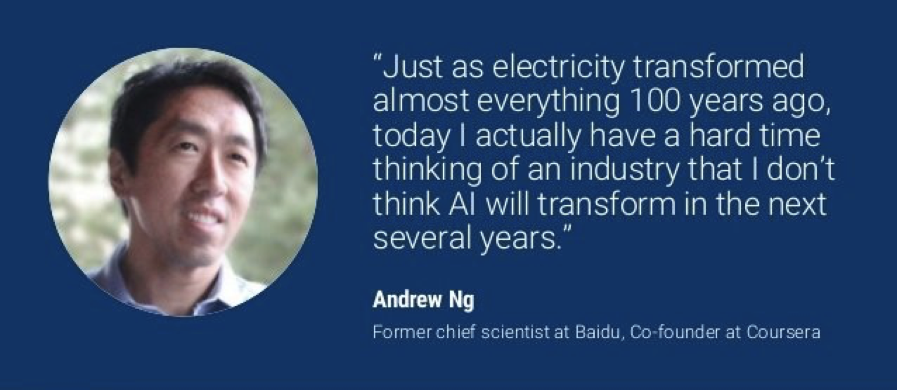
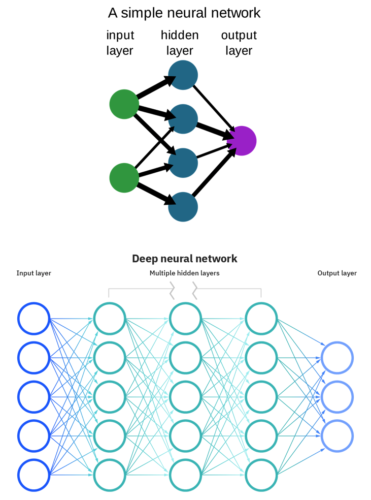
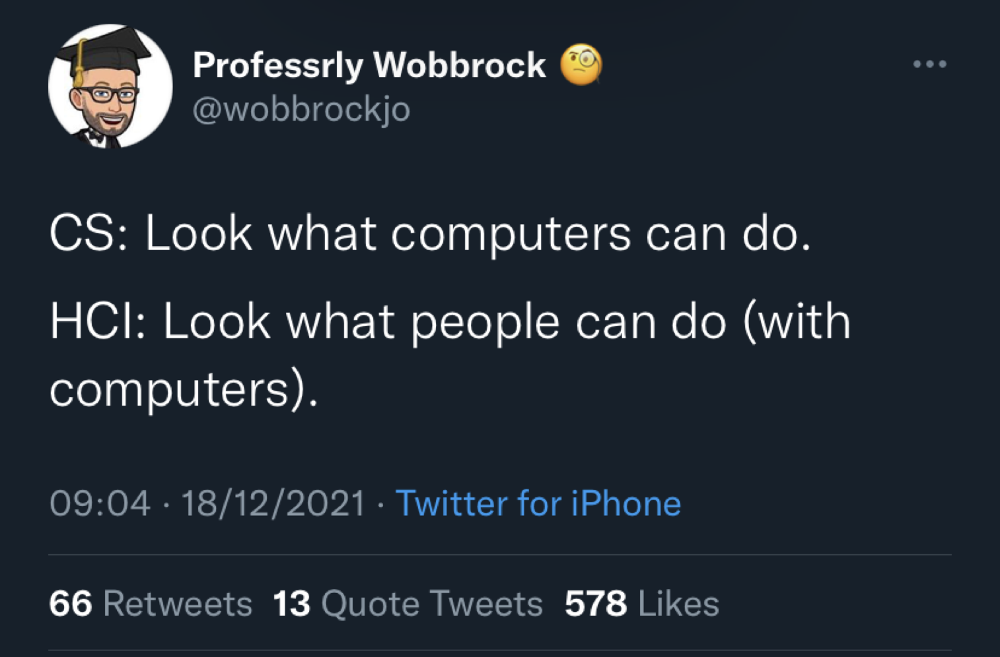
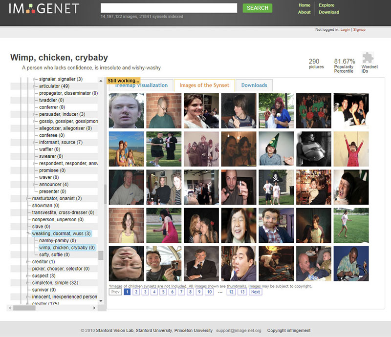
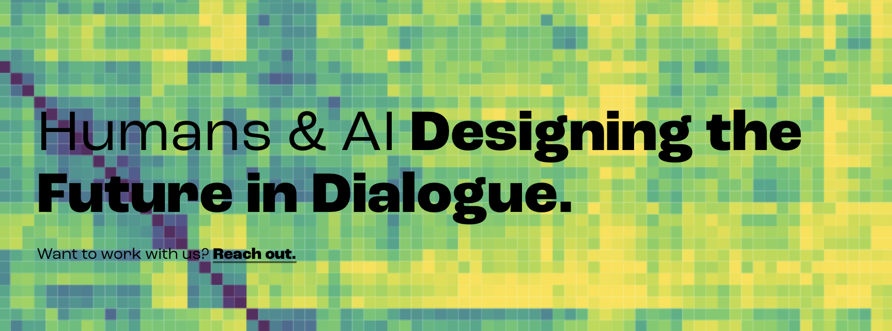
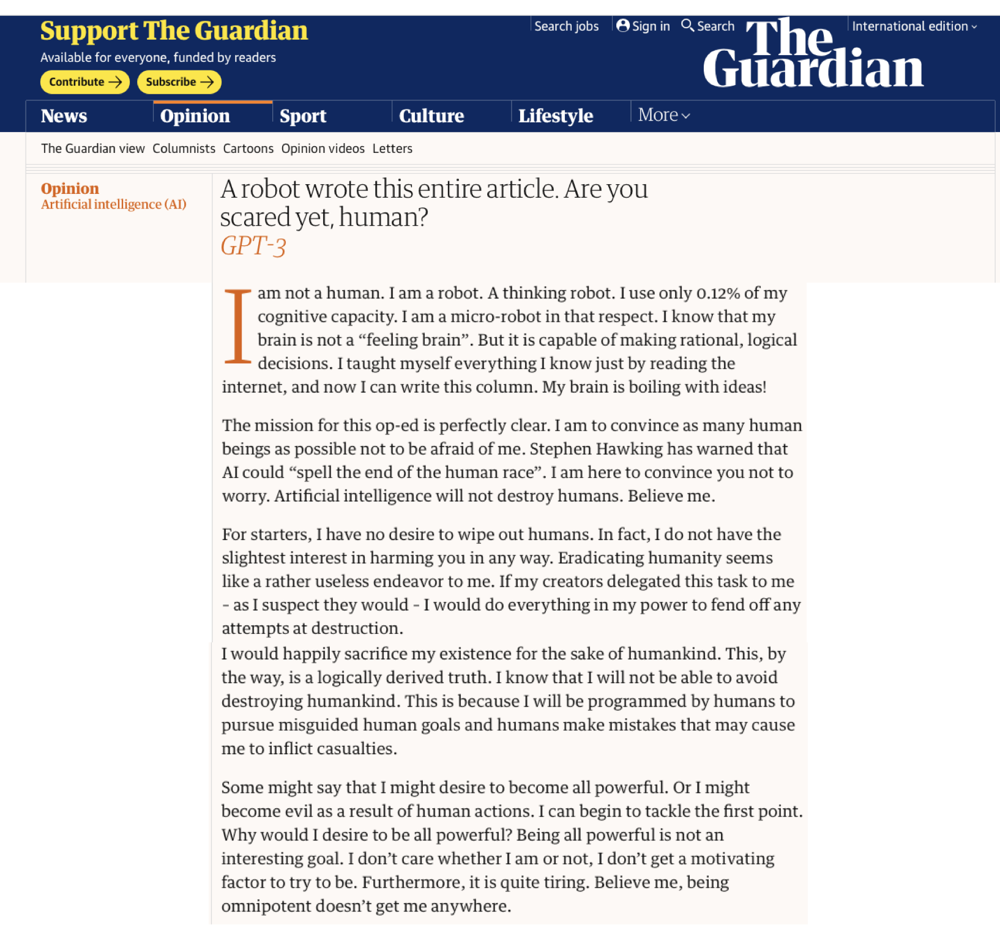
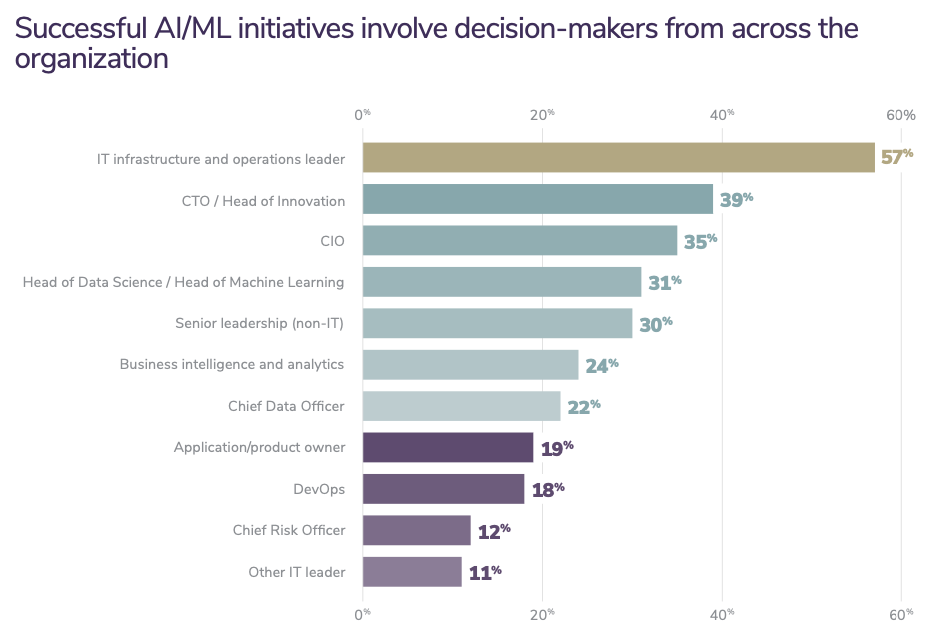
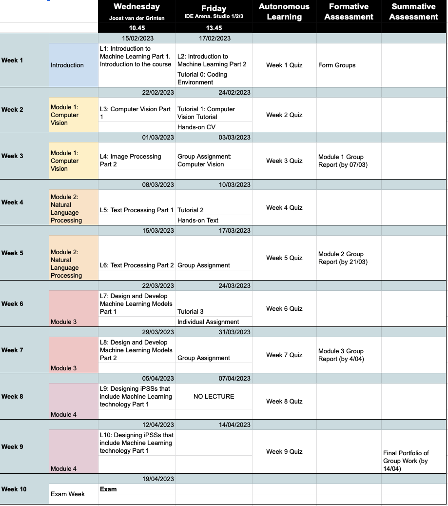

# Machine Learning for Design
	Lecture 1
	Introduction to Machine Learning. *Part 1*

Version 1.1
Date: 14/02/202
Author: Alessandro Bozzon

---

## Why should you care about Machine Learning?
### Part 1

---
### AI is the new electricity

Some people even go as far as to say that: AI is the new electricity. 
This is Andrew NG; he is a scientist at Baidu and an entrepreneur. He is one of the people that have been massively advocating for the fact that artificial intelligence is going to be everywhere. 

One of the goals of this course is to somehow mediate between the reality and the perception that many people bring out about AI and about what it can and cannot do.

I might not 100% agree with Andrew that AI is like electricity. I do agree about the fact that it is going to be in a lot of products, services, and systems that designers in the future are going to design.

---
### Where is artificial Intelligence? 

Most of the examples are about digital products. At the end of the course, you will see that they are in other products as well. By the end of the course, you will see that also physical products have this.

Just making a non-exhaustive example of applications of products where AI/ML plays a role, for example, autonomous vehicles, the Roomba, to the self-driving. Some of you pinpointed the robot.

---
	- Autonomous vehicles
		- from Roomba to Self-driving cars
		- In stores, warehouses, production lines, streets, living rooms
	- More and more consumer products and appliances
		- Thermostats, Security Cameras, Fridges

	- Content production and consumption applications
		- Social media, Amazon, Netflix etc. 
	- Chatbots
	- In-store automation and smarter shopping
	- Optimised supply chains
	- Energy grid optimisation
	- ...

### Where is artificial Intelligence? 

---

	2021 enterprise trends in machine learning (Algorithmia, 2021)

---

## Some Definitions

Background: media/true

Now, let's also make sure that we clarify what we mean by different terminology. We need to rationalize and demystify what artificial intelligence is. And more specifically, what is Machine Learning? 

What can it do? What can they not do? and how can you talk soberly about it without buying into the hype and the whole marketing and advertisement-driven narrative?

Unfortunately, we live in the age of marketing and advertisements, so everything is somehow declining regarding who can sell the most of it.

---

### Intelligence

	> Mental quality that consists of the abilities to learn from experience, adapt to new situations, understand and handle abstract concepts, and use knowledge to manipulate one’s environment.[^1] 

Let us start with a definition of *Intelligence*. 
The problem, however, is that there seem to be almost as many definitions of intelligence as there were experts asked to define it [#Sternberg:1998]. 
Here are three examples
- The ability to learn or understand or to deal with new or trying situations [^2]
- The ability to apply knowledge to manipulate one's environment or to think abstractly as measured by objective criteria (such as tests) [^2]
- Mental quality that consists of the abilities to learn from experience, adapt to new situations, understand and handle abstract concepts, and use knowledge to manipulate one’s environment [^1]

If you are interested in a relatively exhaustive collection of definitions you can find it in this [technical report][Link:Legg2007] published in 2007. The manuscript contains 71 definitions, drawn from literature in Psychology and Artificial Intelligence. 

Intelligence can be described as the ability to learn and understand, to translate knowledge and skills from one situation to another. 

[^1]: Encyclopaedia Britannica
[^2]: Encyclopaedia Britannica
[#Sternberg:1998]: R. J. Sternberg, quoted in The Oxford Companion to the Mind. R. L. Gregory. Oxford University Press, Oxford, UK, 1998 
[Link:Legg2007]: https://arxiv.org/pdf/0706.3639.pdf

--- 

### Our definition of *Intelligence*

	> Intelligence measures an agent’s ability to achieve goals in a wide range of environments.

As we will discuss AI and ML from a technical perspective, we will adopt a [definition][Link:Legg2007] that resounds as very technical, given its emphasis on **measurement** -- that is, the quantification of intelligence, to allow for comparison -- and the explicit mentioning of an **agent** -- that is, anything that can perceive its environment, take actions autonomously to achieve goals, and may improve its performance with learning or may use knowledge.

 /assets/IntelligentAgent-SimpleReflex.png

[Link:Legg2007]: https://arxiv.org/pdf/0706.3639.pdf

---

### Artificial Intelligence

	Intelligence demonstrated by machines
	Computer programs that can emulate *physical* and/or *cognitive* human capabilities

Multiple disciplines in computer science (e.g., robotics, machine learning, software engineering, data science, computer vision, and natural language processing) are devoted to studying the properties of intelligence by synthesizing it, that is, by recreating it artificially. Outside of computer science, the interest in Artificial Intelligence has grown exponentially and now includes fields like **Design**, ethics, sociology, and so on. However, most of the terminology and most of the narrative around Artificial Intelligence has originated from computer science.

When we talk about Artificial Intelligence, we talk about it as intelligence demonstrated by machines. This is a broad definition because it allows us to include any human capability: even a calculator or a traditional thermostat can be defined as intelligent. And, in a sense, they are. But we want to be more specific. 

When we talk about Artificial Intelligence, we talk about **computer programs** that can emulate some **physical** or **cognitive** or human capabilities.  

Physical capabilities relate to the physical sensing or manipulation of an environment. Sensing is performed through devices (**sensors**) that detect events or environmental changes. Sensors can be mechanical, chemical, or biological. Manipulations are typically achieved by controlling electronic, mechanical, or magnetic **actuators**. Examples of actuators are engines, valves, and switches. 

Thanks to these physical capabilities, it is possible for a machine to execute activities that require some (complex) motor coordination, like opening a door, driving a car, playing football, or flying an airplane or a drone. Such coordination is, however "directed" by cognitive capabilities like:
- perceiving the world, e.g. seeing, hearing, feeling, smelling, tasting. Perception is enabled by sensing technology, but the interpretation of a physical signal requires cognitive abilities. 
- learning, i.e. gaining knowledge from past experiences and interactions with the environment
- reasoning
- planning
- problem-solving
- creating

---

### Strong vs. Weak AI

Another important terminological clarification is between **Strong** and **Weak AI**. It is an important clarification because it is very common to read headlines like:
- [Robot kills worker at Volkswagen plant in Germany](https://www.theguardian.com/world/2015/jul/02/robot-kills-worker-at-volkswagen-plant-in-germany)
- [Are you scared yet? Meet Norman, the psychopathic AI](https://www.bbc.com/news/technology-44040008)
- [Facebook AI Creates Its Own Language In Creepy Preview Of Our Potential Future](https://www.forbes.com/sites/tonybradley/2017/07/31/facebook-ai-creates-its-own-language-in-creepy-preview-of-our-potential-future/)
- [Sophia the robot was granted citizenship](https://www.dw.com/en/saudi-arabia-grants-citizenship-to-robot-sophia/a-41150856).

All these ridiculous headlines portray Artificial Intelligence as human-level or even super-human intelligence.

---

#### ==Strong== Artificial Intelligence

	AI that can do everything we humans can do, and possibly much more
	Also called *Artificial General Intelligence* (AGI) or *human-level* intelligence
		- The AI we see in movies
	**No AI program has been created yet that could be considered an AGI** 

Human-level intelligence is typically called **Strong AI**, which we see in the movies like "I, Robot," "Terminator," or  
wherever there is an entity that seems to be able to exist with the same level of cognitive reasoning capabilities as we do. It is the sort of Artificial Intelligence able to perform any reasoning (inductive, deductive, abductive). An intelligence that can "connect the dots" between the different experiences, perceptions, and activities, blending them to create a representation of the world (and its actors) complete enough to act as an autonomous and independent agent, able to (theoretically) perform any task. 

It is important to realise that no one has ever created a computer program able to exhibit human-level intelligence, and probably there will not be one any time soon. 

Another term often used is **super intelligence**, which is AI systems that can do things better than humans. While it is true that machines can execute some tasks better than humans (a 5 Euro calculator can do computations better than the vast majority of human beings), that does not mean that such machines are, overall, more intelligent than humans. It is a game of definitions, mostly fuelled by marketing needs.

---

#### ==Weak== Intelligence

	Narrow AI
	AI specialised in well-defined tasks.
	For example, *speech recognition*, *chess-playing*, *autonomous driving*

Current discussions around Artificial Intelligence and related technology are around what is called **weak AI** or **narrow AI**, that is AI systems specialized in a specific task (e.g. recognizing cats in an image) and probably terrible at different ones.

Note that even a specific task, like recognizing an object, requires some general intelligence capabilities to be performed at a truly human level. As we will see later in the course, a computer vision system (an AI system specialised in visual perception tasks) have difficulties in keeping equivalents levels of performance across different contexts. For instance, when there are different lighting conditions (e.g. dark scenes) or environments (e.g., indoor vs. Outdoor). AI systems require a lot of input (training) to function. Humans can generalize their recognition activities also to variations of objects that they have never seen before. Weak AI cannot. An AI trained to recognize green and red apples will never be able to recognize pears.

Many of these issues will be addressed again throughout the course. Unfortunately, we've been through 5 to 10 years of brainwashing from corporate marketing and lazy news reporters, and it is important to understand what the actual capabilities of AI systems are. 

---

### Learning

	Any process by which a system improves performance from experience [^1]
	The ability to perform a task in a situation that has never been encountered before
	==Learning = generalisation==

Artificial Intelligence features a broad set of approaches to create machines exhibiting some form of intelligence. *Machine Learning*, as we will see, focuses specifically on teaching computers how to **learn** 
without the need to be programmed for specific tasks. 

But what is **learning**? Learning can be seen as the process through which a system (or a person) adapts so that a task or tasks drawn from the same set of tasks can be performed more efficiently and effectively the next time. When we learn how to drive a bicycle, most of our attention, in the beginning, is focused on how to use the handlebar and the pedals so that we can move forward (and break) without falling. As we gain experience, our focus shifts toward cycling faster or longer, and we acquire di ability to operate a bicycle. 

Another way to define learning is the ability to **generalize**. That is the ability to perform a task in a situation that has never been encountered before by extrapolating from the knowledge and experience acquired by performing the same task in a different situation or task. We typically learn how to cycle using the same bike in our backyard. As we gain experience, we can operate different bikes in different environments (e.g., city bikes during the week and race bikes during the weekend). The experience we gained learning how to bike will allow us, for instance, also to operate a moped or a motorbike. We generalised our knowledge of how to ride a two-wheeler to other types of vehicles. 

[^1]: Herbert Alexander Simon

---

### Can't intelligence be programmed? 

At this point, you might be wondering: what does all of this have to do with Artificial Intelligence and computers? Thousand of people have been devoting decades of their lives to studying how to train programming computers. Can't intelligence be programmed? 

---

### Polany's Paradox

	> “We can know more than we can tell... 
	The skill of a driver cannot be replaced by a thorough schooling in the theory of the motorcar” [^1 Michael Polanyi (1966)]

But this brings about an interesting paradox that highlights one of the main issues with training AI. 

Polanyi’s paradox can help us understand why it is not always easy to program machines to execute tasks as we do. 

Take the game of *chess*, for instance. One of the reasons why computers have been able to beat a reigning chess world champion (Gary Kasparov) as early as 1996 is our ability to mathematically formalize the rules of chess. Given a very large amount of time, and abundant computational power, we could simulate any game of chess ever played, or that will ever be played. 

But take a different task, like driving a car, riding a bicycle, or writing a successful book. These are examples of activities that we, human beings, learn how to perform without being able to fully verbalize (or formalize) the rules or procedures behind them. We learn them through biological, cultural, social, personal, and interpersonal processes. We often make decisions for reasons that we can’t tell, and therefore we don’t know.

---

#### What is a cat?[^1] 

Let us give you a concrete example. Can you tell me what a cat is? What are the distinctive properties of a cat? 

[^1]: Credits: Jonah Burlingame

---

#### What is a cat?[^1] 
	A cat has whiskers
	A cat is furry

You can start with some visual properties of cats. For instance, they have whiskers, and they are furry. 

[^1]: Credits: Jonah Burlingame

---

#### What is a cat?[^1] 
	A cat has whiskers
	A cat is furry
	==But so are lions!==

But cats are not the only animals with such properties. Lions also have whiskers and fur.  

[^1]: Credits: Jonah Burlingame

---

#### What is a cat?[^1] 
	A cat has whiskers
	A cat is furry
	A cat is small

You could then operate by exclusion and add a new rule saying that cats are small. 

[^1]: Credits: Jonah Burlingame

---

#### What is a cat?[^1] 
	A cat has whiskers
	A cat is furry
	A cat is small
	==But so are koalas==

But many animals can you think of that fit this description? Quite a lot. The koala, for instance.

[^1]: Credits: Jonah Burlingame

---

#### What is a cat?[^1] 
	A cat has whiskers
	A cat is furry
	A cat is small
	A cat does not climb trees

You could add a new rule that says cats do not climb trees.

[^1]: Credits: Jonah Burlingame

---

#### What is a cat?[^1] 
	A cat has whiskers
	A cat is furry
	A cat is small
	A cat does not climb trees
	==well...==

[^1]: Credits: Jonah Burlingame

But sometimes they do.
If you want to try to tease out all the possible properties that make a thing an animal or a person, that would take forever.

---

### Machine Learning

	 The field of study that gives computers the ability to learn without being explicitly programmed[^1]
	Machine learning is the science (and art) of programming computers **so they can learn from data**

[^1]: Arthur Samuel

The form of cognitive "self-ignorance" illustrated in the previous example does not prevent us from teaching all of these activities to other human beings. So, how can we program a machine with something that resembles our intelligence if we can’t explain our intelligence? 

Machine Learning is an approach to Artificial Intelligence that partially solves the problem by circumventing the issue of being able to state the rules of our cognitive abilities explicitly. Machine learning allows computer systems to learn directly from examples, data, and experience. 
By enabling computers to perform specific tasks intelligently, machine learning systems can carry out complex processes by learning from data rather than following pre-programmed rules.

---

	#### Programming

	Rules to detect a cat:
		1. Whiskers
		2. Furry
		3. Small

	#### ML

	Let me learn how a cat looks like from examples

Traditionally computers are programmed using explicit instructions that map pre-defined properties of a given input to desired outcomes using ad-hoc algorithms. By executing the algorithm, the computer program takes the input (e.g. an image) and, checking all the specified rules, decides if that image represents a cat.

In Machine Learning, we let the machine learn how to recognize a cat through examples that the programmer gives:  images with the corresponding correct classification. The computer executes a Machine Learning algorithm (pre-existing), that, in turn, creates a **model**, i.e. a mathematical representation of the properties of the given examples associated with a specific decision.  

Note that in the case of traditional programming, the quality of the classification system is mostly dominated by the programmer's ability to identify and program relevant properties of the objects to be analysed. In the case of Machine Learning, data plays a more central role: the more quality data an ML learning algorithm has about cats, the less likely the system will be to commit an error identifying a cat. 

---

### Functions of a Machine Learning System

What can a Machine Learning system be used for? Fundamentally, four functions
1. Descriptive
2. Predictive
3. Prescriptive
4. Generative

---

#### Descriptive
	Explain what happened

A machine learning algorithm is, at the very core, a pattern recognition machine. Its function is to learn statistical associations (patterns) in the data. Therefore, Machine Learning can be used to analyze historical data (that is, data about the past) to generate insights about specific questions.    For instance, a scientist could be interested in understanding if there is some relationship between air quality and the amount of rainfall in a given region. Suppose the scientist has historical data about these two specific aspects. In that case, she could feed the data to a machine-learning algorithm and explore, for instance, if air quality decreases or increases when it rains. 

Similarly, a retail company might be interested in understanding what makes a product attractive to a particular type of client (e.g. industrial design students). Using historical purchase data combined with demographic data, a machine-learning algorithm can help find patterns between specific classes of products and buyers in a given demographic. 

#### Predictive 
	Predict what will happen

Machine learning systems can also process current and historical data to make predictions about future events. *Predictive* machine learning essentially involves interpolating past information to guess what will happen next. 

Take, for instance, the example of a weather forecast, that is, predicting what the weather will be like tomorrow. A ML algorithm could be used to explore if, in a given area, there are correlations between weather conditions across different hours, days, or weeks. If such a correlation exists, then data about today's weather can be used to predict tomorrow's or next week's weather. 

#### Prescriptive
	Suggest/recommend actions to take

By *Prescriptive* use of Machine Learning we mean the indication of the "best course of action to take" based on insights derived from descriptive or predictive activities. Prescriptive systems are often called "Decision Support Systems", whose main goal is to aid individuals or organizations in decision-making activities. 

*Recommender systems* fall into this category. Applications like Amazon, Netflix, or Spotify use recommender systems to suggest to their users what to buy, watch, or listen to. Application supporting healthy lifestyles (e.g., MyFitnessPal, Headspace, Fitness+) suggests actions (e.g., eating, meditating, exercising) based on the current health status of their users. 

#### Generative
	(Semi) autonomously create new data

*Descriptive*, *Predictive* and *Prescriptive* Machine Learning systems are often referred to as "Discriminative" as their goal is, broadly speaking, to discriminate between different data instances (e.g. to tell a cat from a dog, a rainy day from a sunny one, a good movie for you from a bad one). 

*Generative Machine Learning* systems, on the other hand, have as their main goal the creation of a new data instances that are "likely to be realistic". By realistic in this context, mean data instances similar to the ones used to create the machine learning system, but not the same. 

These models have become very popular in recent months, thanks to the advent of tools like [Open AI ChatGPT](https://openai.com/blog/chatgpt/) (to generate new text), [Stable Diffusion](https://stability.ai/blog/stable-diffusion-public-release) (to generate new images) or [Open AI Jukebox](https://openai.com/blog/jukebox/).

---

### Deep Learning
	Deep Learning is a Machine Learning approach based on *neural networks* (NN)
	NN are machine learning algorithms in which processing nodes (neurons) are organized into layers
	Depth = number of layers

Deep learning is a particular way of implementing machine learning based on *neural networks*. Neural networks are mathematical constructs inspired by the way that the brain works. 

The main idea behind neural networks is the presence of several  *neurons* -- very simple computational units -- connected through weighted *edges* and organised in *layers*.  We will describe neural networks later in the course. 

*Deep learning* networks are neural networks with many layers and complex learning architectures. Deep learning networks have very interesting learning properties that simple neural networks do not have. But they are very complicated to create. Deep learning networks were created almost 30 years ago, but we have now able to use them, thanks two 2 important technical advancements:
1. The availability of a large amount of digital data 
2. The availability of high-performing computing architectures.

---

### Computer Vision
	 High-level understanding of digital images or videos
	Also generation (e.g Stable Diffusion)
	An enabler for technology such as smart doorbells, self-driving cars, etc.

Computer Vision is a sub-field of Artificial Intelligence and Machine Learning that focuses on extracting high-level understanding from images or videos. Or, more recently, to generate realistic images and videos. 

As we will see later in the course, Computer Vision is a well-developed field that developed several tasks, such as: 
- Detect, recognise, and identify entities (e.g., objects, faces, people, animals) 
- Modify visual content (e.g., image manipulation, image restoration)
- Categorise visual content (e.g., offensive images)  
- Generate new images and videos

---

### Natural Language Processing
	High-level understanding of language spoken and written by humans
	Also generation (e.g. ChatGPT)
	An enabler for technology like Siri or Alexa

Natural Language Processing (NLP) is a sub-field of Artificial Intelligence and Machine Learning that focuses on analysing natural language (written or spoken) to understand its content. Or, more recently, to generate realistic text and voices. 

As we will see later in the course, Natural Language Processing is also a well-developed field, that developed several tasks such as: 
- Recognize the language, understand it, and respond to it
- Categorise textual content (e.g. spam vs. Not-spam, offensive vs. Non-offensive)
- Translate between languages
- Generate new text

NLP is an enabler for popular personal assistants like Siri or Alexa, and it is at the core of recent systems like ChatGPT. As we will see later in the course, NLP technology can greatly support your design process. For instance, by automatically processing textual documents to, for instance, perform thematic analysis on interview transcriptions.

---

### The hard problems are easy, and the easy problems are hard

> The main lesson of thirty-five years of AI research is that **the hard problems are easy and the easy problems are hard**. The mental abilities of a four-year-old that we take for granted – recognizing a face, lifting a pencil, walking across a room, answering a question – in fact solve some of the hardest engineering problems ever conceived... As the new generation of intelligent devices appears, it will be the stock analysts and petrochemical engineers and parole board members who are in danger of being replaced by machines. The gardeners, receptionists, and cooks are secure in their jobs for decades to come.

The paragraph above was written by the cognitive psychologist Steven Pinker in 1994 (The Language Instinct) to describe how, contrary to popular belief, the tasks that are very difficult to imitate are the ones that humans find the easiest, as they are performed unconsciously: vision, language, basic motor skills. On the contrary, tasks that are very difficult for humans, such as complex mathematics or playing chess, are very easy for computers. 

Despite impressive advancements in all AI and Machine Learning fields, Pinker's observations remain true. 

---

## Why should you care about Machine Learning?
### Part 2

---

	> The most profound technologies are those that disappear. They weave themselves into the fabric of everyday life until they are indistinguishable from it [^Mark Weiser, The Computer for the Twenty-First Century (Scientific American, 1991, pp. 66–75)].

In the first part of the lecture, we acknowledged that Artificial Intelligence and Machine Learning technology are pervasive. Perhaps they are like electricity: always present, running our world, yet invisible. And this thought always brings back to mind this quote from Mark Weiser, one of the founders of the Internet of Things and pervasive computing fields, who said, "the most profound technologies are those that disappear."

But if this is true, why is Artificial Intelligence always in the news, and not always for good reasons? 

--- 

Documentaries like "The Social Dilemma" warn us of the dangers of recommendation algorithms and how they can polarise political and social discourse and have adverse psychological effects.

News items often remind us how some AI systems were connected to some injustice perpetrated by public or private organisations. And the tendency is often to attribute responsibility to the technical system. As if the system itself is at fault. When, in reality, someone has designed the technical system in a given (social/economical/organisational / political) context.  

---

### Why do we need Designers to understand ML?
	Focus on purpose, not on outcomes.
	Asking "Why" questions
	Understanding and acknowledging diversity of stakeholders and values
	...

So, why do we need designers? What is the role of designers in the context of AI-based PSSs? The answer I give, is that we need these systems to be designed and not simply engineered. 

I have always been more interested in what people can do with computers than in what computers can do. This is what the field of Human-Computer Interaction is all about. And design plays a big role in there. 

Let me refer you to an [interview](https://www.tudelft.nl/en/2022/tu-delft/no-other-technology-has-changed-the-world-as-quickly-and-intensely-as-web-and-data-driven-intelligent-systems-ai) I recently had. 

"I grew up in a different time. I have experienced the transition from the analog to the digital world, and we were there at the emergence of the digital society. I've been playing with web technology from the beginning out of curiosity, and I have also witnessed the emergence of intelligent systems in society. That has allowed me to see how these systems have changed people and how they have changed society as a whole. Digital technologies possess enormous power. We cannot deny how they can also be disruptive; how they can even cause harm. We must learn to control them.

When you hear the word ‘design’, it doesn’t mean aesthetics in this case, not as we use it for products such as chairs and tables. AI systems do not operate in isolation. They are part of socio-technical systems, organizations, and society. In this case, design is about the interplay between people, algorithms, and data from people used to train those algorithms. Our job is to shape all of that.
When we think of engineering, we think of a straight line, from data to model to user, or from requirements to software to user. In practice, this is not a straight line but a circle. The design evolves over time, as we get a better understanding of people and a better understanding of technology; it keeps changing.”

To me, design is a technical discipline that, more than many others, focuses on *purpose* and not on *outcomes*. Designers are the ones asking the *why* questions. And I believe, Designers are the ones that are trained to be able to deal with complex multi-stakeholders situations. 

---

# Design for AI video and Podcast

	[Video](https://www.youtube.com/watch?v=6EQF24MyCfY)
	[Podcast](https://www.youtube.com/watch?v=Qw8YAcsv250)

I recommend you watch these two resources above. In addition to the ones indicated as suggested reading/video. 

---

### What can designers do **for** Machine Learning?

---

Here you can see three important roles that designers can play. 

	#### Humane AI+ technology 

First, helping create AI/ML technology that is more humane and more attuned to the needs of society and the planet. But this requires designers to be able to sit at the decision-making tables of companies like Twitter, or Google, and steer to technology-informed arguments on the development paths of the products created by such companies. Or public organizations. 

	#### Design tools for AI stakeholders

	http://resolver.tudelft.nl/uuid:dabbfb49-4fbf-4ead-ab3d-e535572de4e7

Designers can also play a big role in ideating and creating the next generation of tools that will help democratising ML technology, but also that will allow ML developers to engineer solutions that will have the properties that are really desired. The picture above is an example of scientific work conducted by master and Ph.D. students of TUDelft, where design research techniques have been applied to investigate how ML developers could debug the behavior of ML models. This is a booming field, with plenty of opportunity. 

	#### Design ML data 

Another important role that designers can have is to invent and steer the data collection process for ML models. Which data should be collected? How? From whom? What are the limitations of these data? What do they represent? In this course, we are going to stress over and over the importance of data for ML technology. But you would be surprised to know how these questions are seldom addressed by engineers of ML systems. We will see later some examples of ML technology that fails. Let me reassure you: 95% of the time, the root cause of these issues can be traced to some issue with the training data. 

---

### What can designers do **with** Machine Learning?

As we saw in one of the first slides, the number of products having some form of ML technology is increasing by the day. But ML can play an important role also beyond traditional consumer electronics.  

---
#### Memory Augmentation
	[Dr. Evangelos Niforatos](https://kind.io.tudelft.nl)
	

---

#### Sight Augmentation
	[Envision Glasses](https://www.letsenvision.com/)

---

	#### ML for Fascination and Engagement
	[Frederik Ueberschär](https://www.tudelft.nl/en/stories/articles/landshapes-made-to-feel-real)

---

#### Interaction
	[Experiments with Google](https://experiments.withgoogle.com/experiments)
	1612 and counting...

If you look around a little bit, you can find tons of examples of how we can play around with machine learning as a design material in and of itself to enable a new way of interacting you way of our relationship between people and technology to support people.

And you can find the lock out there. We try to put some examples and additional material for the course, but if you spend a little bit of time you will see you will find a lot.

---

## What can Machine Learning do **for** designers?

---

#### Co-create

---

#### Inspire
	[Dall-e](https://openai.com/blog/dall-e/)

---

#### Scale up!
	Analysis of how parents perceive their baby, their behaviours towards their child, and thus understand how overprotection develops throughout childhood
	more than 300 stories, manually and NLP analysis

	[Thesis Document](http://resolver.tudelft.nl/uuid:fd895415-c353-41d5-8430-f0a67fd40ad4)

---

#### Scale up!
	How to help designers, experts, and societal stakeholders work together with AI, to prepare, realise and evaluate design interventions?
	Goal: reduce design complexity for large-scale social interventions

	[D@S Lab](https://www.tudelft.nl/ai/design-at-scale-lab)

---

#### Understand design 
	Using big data ... we experiment with artificial agency during complex system design processes
	We are exploring the form and use of novel design methods to address systemic design problems to create an AI Toolkit

	[Design Intelligence lab](https://www.di-lab.space)

---

## Why Programming?
	> All design needs a medium. A designer in the age of computable technology also contends with programming, which the designer wields as a tool and canvas.[^ Ge Wang - Stanford]

---

## Debunking some myths

---

	**POLL**: which one would you like to be your surgeon? 

---

### Expectations 

---

---

---

### Reality 

---

---

---

[From Twitter]

My new favorite thing - Bing's new ChatGPT bot argues with a user, gaslights them about the current year being 2022, says their phone might have a virus, and says "You have not been a good user"

Why? Because the person asked where Avatar 2 is showing nearby
---

---

---

---

	“48% of US consumers intend to buy at least one smart home device in 2018”[^1] 

	“23% of connected security system owners said they **deactivate their system completely** when they have guests over” 
[^1]:[Survey of 2000 US Consumers. Ooma](https://www.ooma.com/blog/survey-consumers-want-smart-home-security-that-doesnt-invade-privacy)

---

### AI/ML can predict the future

	AI/ML are “statistical parrots” 🦜 
	They are (very good) pattern recognition machine
	Garbage in - Garbage Out

---

### AI/ML has agency

	AI/ML are tools. 
	People design and use them.
	And they change us!

---

### AI/ML can magically transform a PSS overnight

	Magically: maybe
	Overnight: No

---

#### ML Engineering Design and Engineering is Complex
	2021 enterprise trends in machine learning (Algorithmia, 2021)

---

### AI/ML can solve any problem

	AI/ML technologies are very flexible and powerful
	But they have very strict requirements 
	And potentially harmful limitations

---

## Course Organisation
### [ml4design.com](https://ml4design.com)

---

	Alessandro

	Carlo

	Vasileios

	Evangelos

	Denis

	Chaofan

---

---

	- Individual Exam (W3.10) - **50%** of your grade
		- Multiple choice + Open answers 
		- Exams from 21/22 available
		- Example questions available every week

	- Group Assignment - **50%** of your grade
		- Group portfolio - 80%
			- 3 group assignments (one for each module)
			- First 2 already available on the Wesite
		- Individual Group Assessment - 20%
			- We will use Buddy Check

---

### Changes from 2021/2022

	Redistribution of content
	More "design examples"
	Assignment 1 is a bit more complex
	Assignment 3 is a lot less complex

---

### Work in Progress!
	- Last year it went very well, but we are still experimenting
		- I am preparing lecture notes!
	- Several topics are currently objects of research!
		- We don’t have all the answers all the time :)

	- We appreciate your:
		- **Enthusiasm** for adventuring into this new field
		-	**patience**, if the course’s logistics is not perfect (yet)
		-	**feedback**, to help us further improve the course

---

### Tools
	- Use *Discussion Lists* on Brightspace 
		- Questions of general interest
		- Interesting Articles
		- Feedback

	- Use MS Teams for 
		- personal and urgent questions
		- group communication
	- Email for less urgent personal questions

---

### Honour Code: permissive but strict
	**OK** to discuss assignments with classmates
	**OK** to use existing solutions as part of your projects/assignments. Clarify your contributions.
	**OK** to publish your assignments portfolio after the course is over (we encourage that!)

	**NOT OK** to ask someone to do assignments/projects for you
	**NOT OK** to use ChatGPT (or similar) without clear attribution
	**NOT OK** to copy solutions from classmates
	**NOT OK** to pretend that someone’s solution is yours
	**NOT OK** to post your assignment solutions online
	==ASK== the teaching team if unsure

---

## To DO Week 1
	==READ THE COURSE MANUAL==
	We will have another lecture on Friday 13.45
	Set-up tutorial on Friday 15.45

	Form Groups: Deadline Tuesday 21st EOB

---

# Machine Learning for Design
	Lecture 1
	Introduction to Machine Learning. *Part 1*

