# Lecture 3: Lecture Notes

Version 0.2
Date: 21/02/2023
Author: Alessandro Bozzon

---

## A bit more on regression and classification
#### And your very first contact with (deep) neural networks

---

### Linear Regression

--- 

Background: media/true

Let us start with the regression problem and take the simplest, although still very used—linear regression model. 

Here the idea is simple. We have data points in a multi-dimensional feature space and their associated label value. We want a mathematical model that best captures the relationship between these data points in that space. The goal is to be able to calculate the label value of new data items accurately. 

In the simple example here, the problem is to estimate the cost of a house (the label) based on its size (the feature). So it is a simple 1-dimensional problem. And we can describe the data points as in the figure. For each data point in blue, we know the house size and its corresponding value. 

---

Background: media/true

If we were interested in estimating the value of a new house, represented here with the red data point, how could we do that? Visual estimation is, of course, not possible in the real world, where the dataset size or the feature dimensionality is much bigger. 

---

Background: media/true

The idea is to find a mathematical function, in the case of linear regression, a linear function (a straight line) that best approximates (best models, best fit) the data in our possession. The linear function is our model. 

The linear function is mathematically expressed as in the slides. The function has only one variable (Size), and the value to calculate is Cost. a and b are the function's parameters: *a* is the intercept (a constant value or bias), and *b* is the slope of the linear functions. In machine learning lingo, these parameters are often called the model's weights. 

In a machine learning model, it is the bias and tells us what the label would be in a data point where all the features are precisely zero.
We aim to find the value of *a* and *b* for which the function is a better fit for our data. How could we do this? 

---

Background: media/true

To explain the method, we simplify the problem and focus on the case where we want to find the best line that fits these three points. Assuming we position the line as in the animation, the question is: which slope (value of the parameter *b*), allows the linear function to fit the training data best?

---

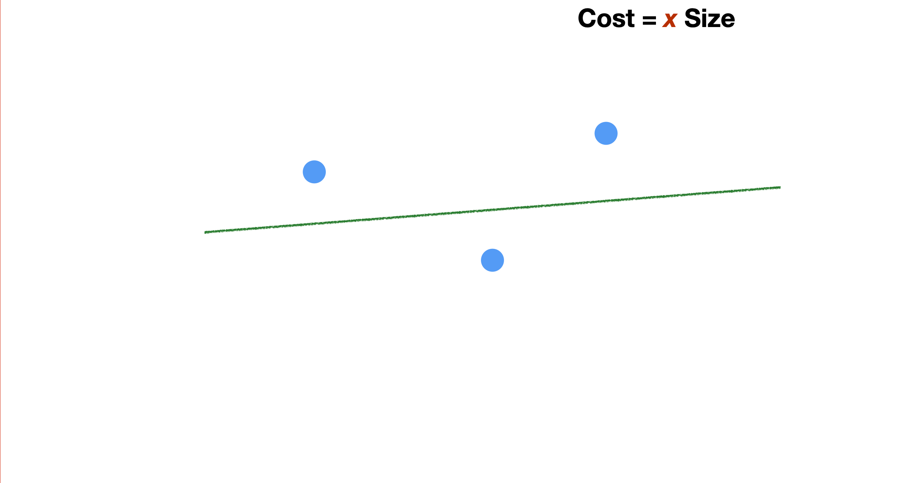
Background: media/true

---

Background: media/true

A standard definition relates to the error made (on average) when using the line to represent the data distribution. So, we calculate the distance (the error) between each point in the training set and the linear function.

---

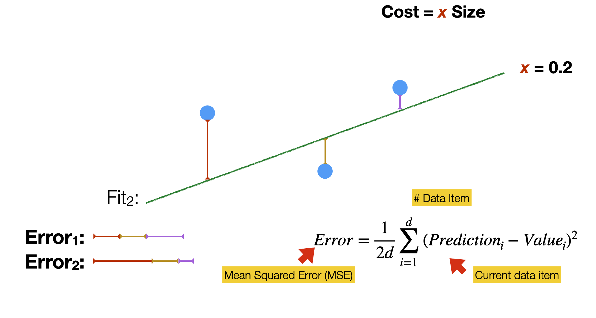
Background: media/true

We do it for every possible slope of the linear function - for a computer, it is easy. To guide the process, we need a cost function. That formula expresses what we mean by “a good model.” In linear regression, we often use the so-called Mean Squared Error, the average of the squared differences between the predicted value and the actual value of a data item. 

We need to find the parameter values that minimise the cost function, that is, the sum of the values of all the errors. This is a quadratic function that looks like a parabola curve.

---

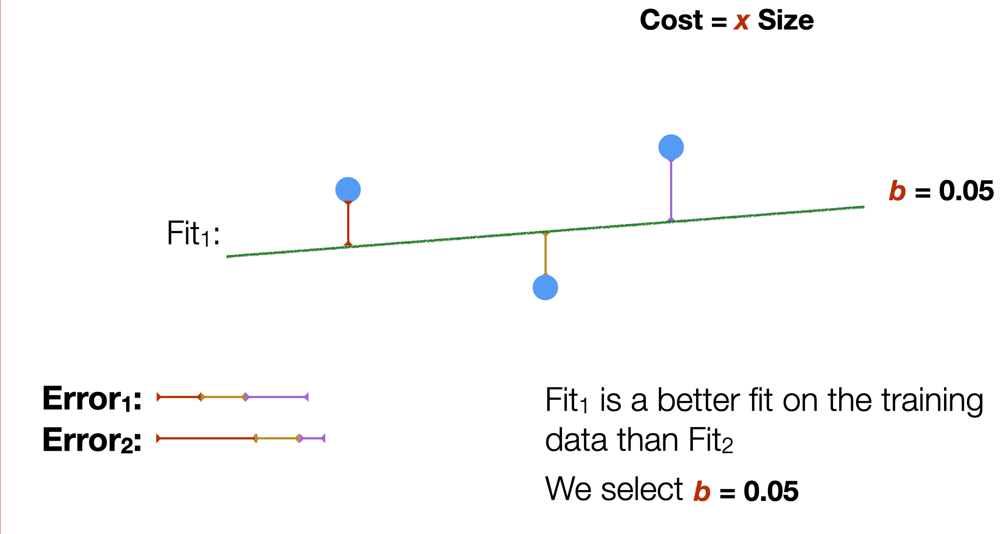
Background: media/true

And we find that the first slop is the one that better fits the training data. 

What we have been doing here is, in a very simple way, training a mathematical model based on the data we have available. The training process had the goal of finding the optimal parameters of the model. In our example, it was b.

---

### Finding the best parameter values
	- ==Training the model==

	- **Gradient Descent**: an algorithm to find the minimum point of a function 
	- **Hyper parameters**: parameters of the Gradient Descent
		- *Learning Rate*: speed of descent
		- *Epochs*: max number of steps

To find the best parameter values, we use a very common approach called **Gradient Descent**. Gradient descent is an algorithmic way to find a minimum point in a differentiable function that doesn’t require knowledge of the shape of that function but only of its partial derivatives. 

Gradient descent is an algorithm that also has two parameters, the **learning rate**, that controls how much the value of the parameter changes at every step. The higher the value, the faster will be the “descent.” But also, the higher could be the risk of “jumping” in less optimal points of the curve. The lower the value, the more accurate yet slow the descent. 
And the **epochs**, that is the maximum number of steps that the algorithm can take before stopping. We need to set a maximum number of epochs because it is possible for the algorithm never to find THE optimal value and thus continuously oscillate between close values. 

---

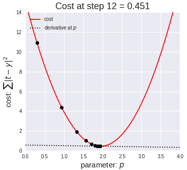

---

Background: media/true

Of course, this is a very simple model, and the data were not so many. So, the optimization could be done quite fast. 

Also, by selecting a linear function, we assumed that the data hold, to some extent, a linear relationship. In many cases, such linear relationships might not hold so we can use more complex models. That is models with more parameters. 

In the example here, we use a polynomial function, which allows defining curves that are “closer” to the data points, thus reducing the error. This is called polynomial regression. 

As we will see later, there are even more complicated models. 

---

### Classification 

--- 

Background: media/true

Let us now look at the classification problem. 

Let’s now assume that we want to classify whether a student will be accepted at a university based on the results of a selection test and their high-school grades in mathematics. This is a somewhat realistic situation, by the way. 

Assuming that we have several students for which we know the values of these two variables (our feature space) and their admission result (yes/no, our binary class). For instance, in the slide, we have two students that were either rejected or accepted based on the two values. 

---

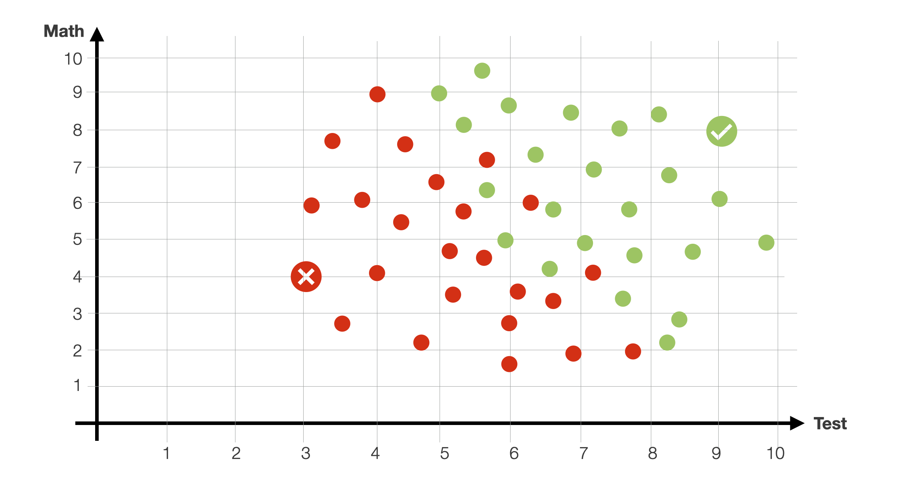
Background: media/true

Our dataset is, of course, bigger. Green dots are students that were previously accepted. The red dots are students that were not accepted. As you can see, there isn’t a clear-cut separation in this 2-dimensional feature space, as some students with a high test grade were not accepted due to low math grades. And vice versa.

---

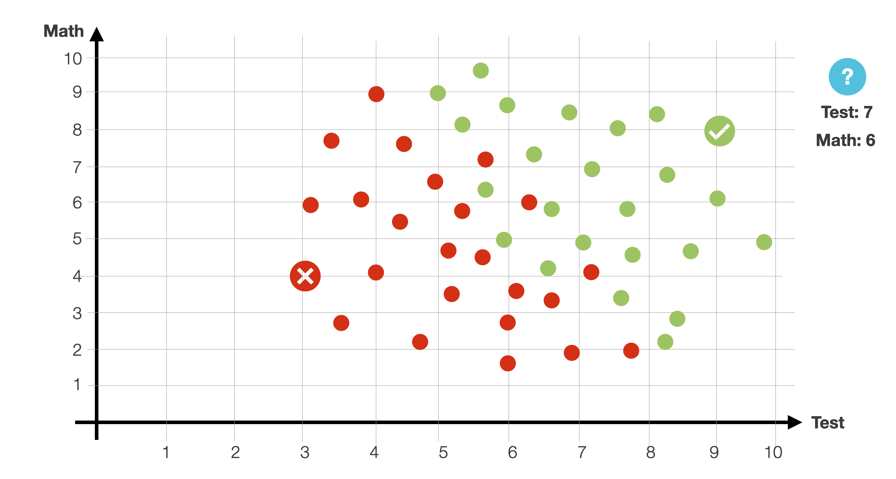
Background: media/true

Assuming that new students are coming. Given a new student applying at a university (math grade 6) and performing the admission test with a 7. Will the student be accepted?

---

Background: media/true

To answer the question, let’s look at the data. Most of the points seem to be separated by a line. Most points over it are green, and most below it are red, with some exceptions. We will say that that line is our model, so when a new student comes in, if they happen to be above the line, we predict they will be admitted. Otherwise, they won’t.

This method is known as Logistic Regression.

How do we find this line that cuts the data in 2?

---

Background: media/true

As before, let me show you an example of how a computer can learn to do this somehow automatically.

Let’s assume that we draw a line trying to separate this bi-dimensional space in 2. 

Exactly line for linear regression, we want to measure how “bad” this line is. To measure it, we use a different error, or cost function. For instance, we can count how many of this points are classified incorrectly. 

In the example here, the number of errors is 2. 
---

Background: media/true

Exactly line for linear regression, we want to measure how “bad” this line is. To measure it, we use a different error, or cost function. For instance, we can count how many of this points are classified incorrectly. 

In the example here, the number of errors is 2. 

As in the linear regression, we will move this line around to try to minimise the number of errors using gradient descent. 
---

Background: media/true

If we move it a little bit, the number of errors decreses

---

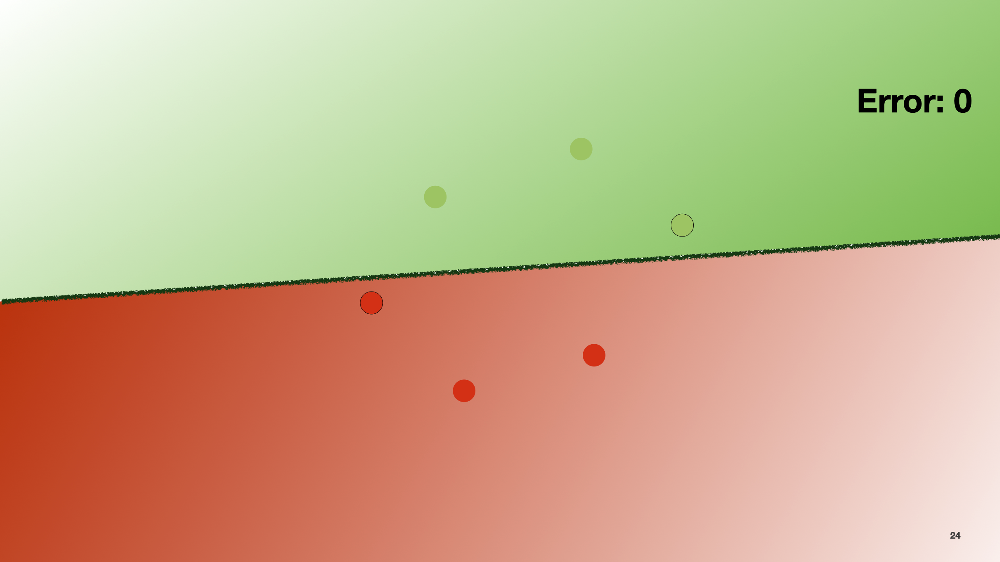
Background: media/true

And of course if we move it again it becomes 0.

In reality, we do not use the number of errors as a cost function, but we use something called Log-loss function. 

Here the mathematical formulatuon becomes a big complex, so we will not indulge further. The intuition beyond this measure is to give high penalty to items that are mis-classified with an high probability (that is, they fall far away from the line), and to give lower penalty to the ones that are misclassified with low proability (so, they are closer to the line). 

---

Background: media/true

Coming back to our examples here, we have a few cases that do not really make sense. People with very low test score, or math scores, that still pass. 

---

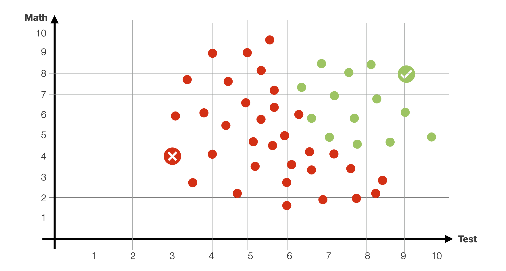
Background: media/true

Let’s change them, to make it a bit more realistic. 

Now, with the data looking like this, we would not be able to fit the with a single line

---

Background: media/true

Let’s change them, to make it a bit more realistic. 

Now, with the data looking like this, we would not be able to fit the with a single line. Maybe with a circle. 

---

Background: media/true

Or with two lines. As before, we can use some gradient descent approach to find the best possible parameters of these two lines, using a similar log function as before. 

---

Background: media/true

This is a neural network. And let me show you intuitively why it is the case.

---

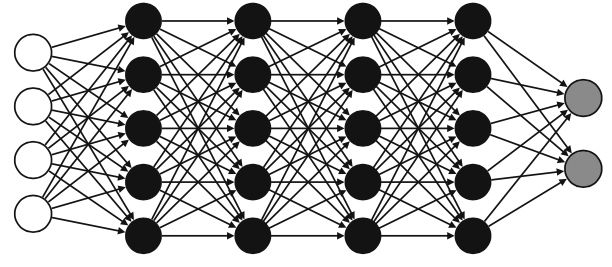
Background: media/true

Neural networks are one of the most popular (if not the most popular) machine learning models out there. Neural networks are meant to, in a broad sense of the word, mimic how the human brain operates. 

The one in the picture is a deep neural network, of the ones that you might have heard of, or that we have discussed previously. They indeed look scary, but we can understand them in a simple way. 

Neural networks are useful for classification and regression.

---

Background: media/true

We call them neural networks because their basic unit, the perceptron, vaguely 
resembles a neuron.

A neuron comprises three main parts: the soma, the dendrites, and the axon. In broad terms, the neuron receives signals coming from other neurons through the dendrites, processes them in the soma, and sends a signal through the axon to be received by other neurons.

A perceptron works in a similar way: it receives numbers as inputs, applies a mathematical operation to them and outputs a new number.

---

Background: media/true

In a *perceptron*
This mathematical operation normally consists of a sum composed of an activation function. 

---

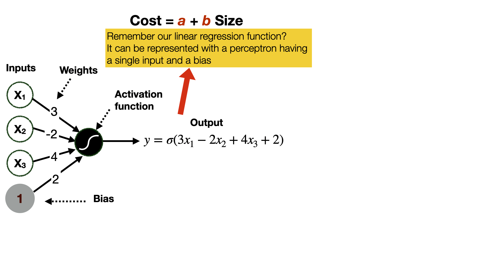
Background: media/true

The sum that is passed to the activation function is calculated by multiplying the input values by their weights, plus the bias - so, a simple weighted linear combinatiom of values. 

In this way, we can represent linear functions in feature space of arbitrary size, including the mono-dimensional one of our previous example with linear regression.
---

Background: media/true

There are many activation functions that could be used in a perceptron. We show two. 
The *step& function returns a 1 if the score was nonnegative and a 0 if it was negative.

The *sigmoid* function works slightly differently, as it outputs a number between 0 and 1. The number is close to 1 if the score is positive and close to zero if the score is negative. If the score is zero, then the output is 0.5.

---

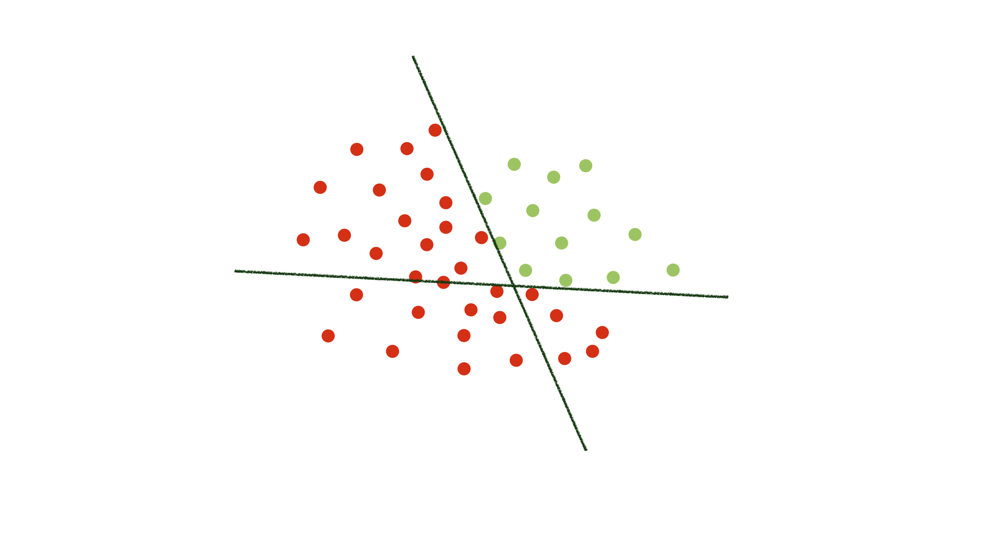
Background: media/true

So, let’s go back to our classification example of before.  
Here we have to linear functions dividing the two-dimensional space. 

What we can do is splitting the problem of classifing the data items into two separate problems - each related to one of the two functions. 

---

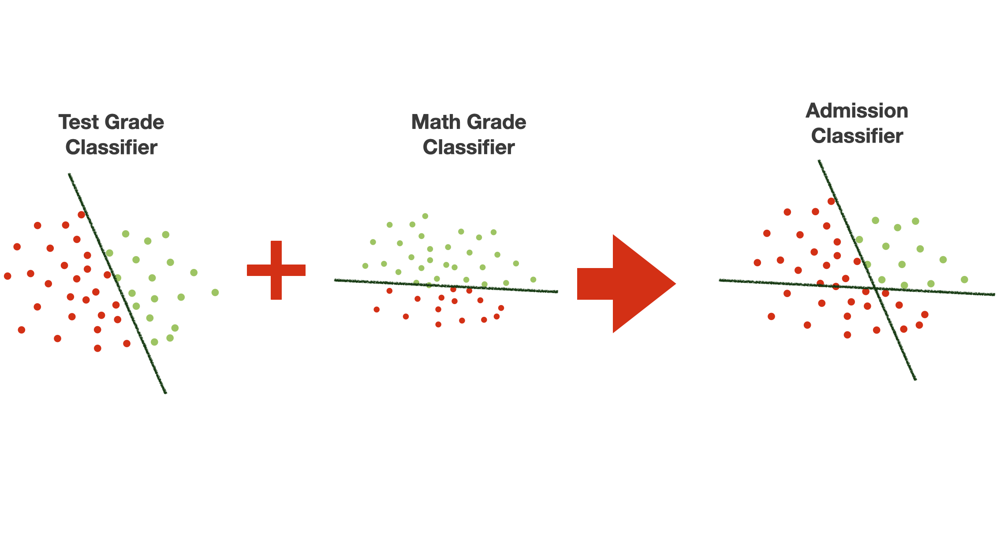
Background: media/true

Let’s say that one function is focused on classifying based on the test grade

---

Background: media/true

This is a neural network. And let me show you intuitively why it is.

---

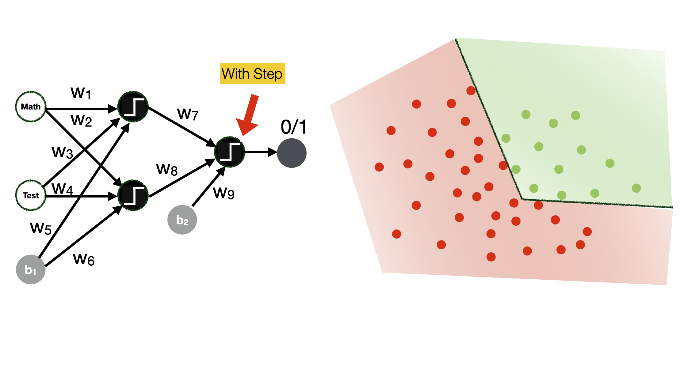
Background: media/true

---

Background: media/true

Here you can see how the use of a sigmoid function can change the boundaries of the classification space

---

### Fully connected Neural Network
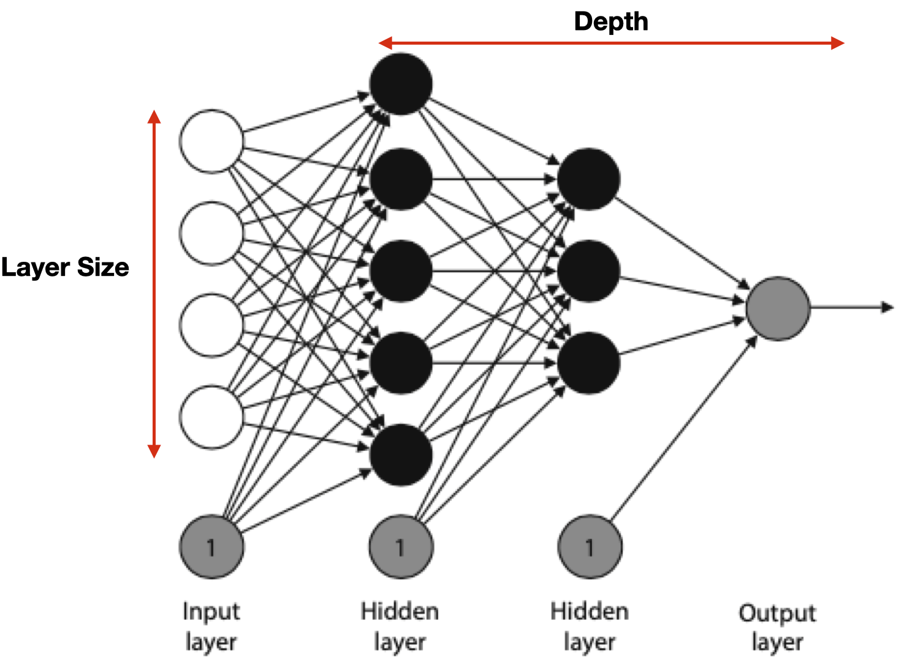

	- **Hyperparameters**
		- Learning rate
		- Number of epochs
		- Architecture
			- #layers, #nodes, activation functions
		- Batch vs. mini-batch vs. stochastic gradient descent 
		- Regularization parameters: 
			- Dropout probability p

So far we have seen examples of a small neural network. In real life, neural networks are much larger. The nodes are arranged in layers, as illustrated in the slide

The first layer is the input layer, the final layer is the output layer, and all the layers in between are called the hidden layers. The arrangement of nodes and layers is called the architecture of the neural network. The number of layers (excluding the input layer) is called the depth of the neural network

Neural networks are often drawn without the bias nodes, but it is assumed they are part of the architecture. However, we don’t count bias nodes in the architecture. In other words, the size of a layer is the number of non-bias nodes in that layer.

The network in the slide has every node in a layer connected to every (non-bias) node in the next layer. Furthermore, no connections happen between nonconsecutive layers. This architecture is called fully connected. For some applications, we use different architectures where not all the connections are there, or where some nodes are connected between non- consecutive layers

Like most machine learning algorithms, neural networks use many hyperparameters that we can fine-tune to get them to work better. These hyperparameters determine how we do our training, namely, how long we want the process to go (number of epochs), at what speed (learning rate), how we choose to enter our data into the model (Batch vs. mini-batch vs. stochastic gradient descent), regularisation parameters, and dropout probability. The last 3 are advanced topics that we will not cover in this course. 

---

### Classifying into multiple classes - *Softmax* function
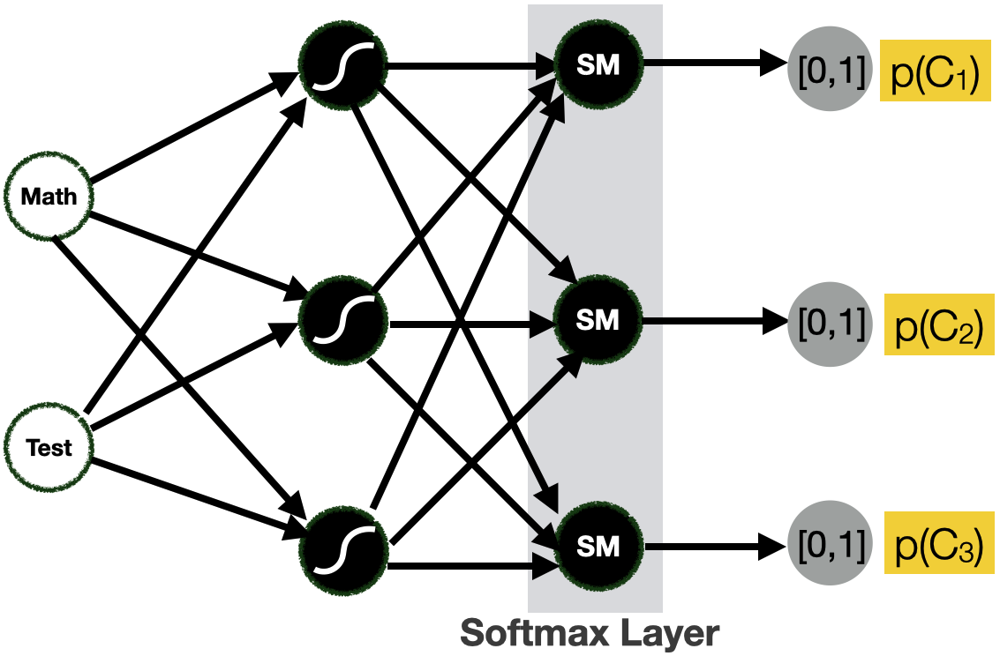

	- Return a probability for each class
		- example C1= ADMITTED, C2 = NOT ADMITTED, C3 = NEW TEST
		- p(C1) = 0.37, p(C2) = 0,21, p(C3) = 0,42
	- We use the *Softmax* activation function for the output layer

Instead of returning a 0 or 1 (step function on the output layer), or a value between 0 and 1 (sigmoid function on the output layer), return a probability for each class

To allow for this situation, we can change the activation function of the output layer into a Softmax function. The softmax function is a function that turns a vector of K real values into a vector of K real values that sum to 1. The input values can be positive, negative, zero, or greater than one, but the softmax transforms them into values between 0 and 1, so that they can be interpreted as probabilities. If one of the inputs is small or negative, the softmax turns it into a small probability, and if an input is large, then it turns it into a large probability, but it will always remain between 0 and 1.

The important assumption is that the true class labels are independent. That is to say each sample of data can only belong to one class. For example, a person cannot be admmited and not addmitted at the same time. Its true label can only belong to one class.

The sigmoid function becomes equivalent to the softmax function when we there are two classes. It is not necessary to calculate the second vector component explicitly because when there are two probabilities, they must sum to 1. So, if we are developing a two-class classifier with logistic regression, we can use the sigmoid function and do not need to work with vectors.

**To use neural networks for regression**

Luckily, we have only two small tweaks to apply to a classification neural network to obtain a regression neural network. The first tweak is to remove the final sigmoid function from the neural network. The role of this function is to turn the input into a number between 0 and 1, so if we remove it, the neural network will be able to return any number. The second tweak is to change the error function to the absolute error or the mean square error, because these are the error functions associated with regression. Everything else will remain the same, including the training process.

---

	[Tensorflow Playground](https://playground.tensorflow.org/)

---

## Machine Learning and Images

---

Background: media/true

---

Background: media/true

---

### Images
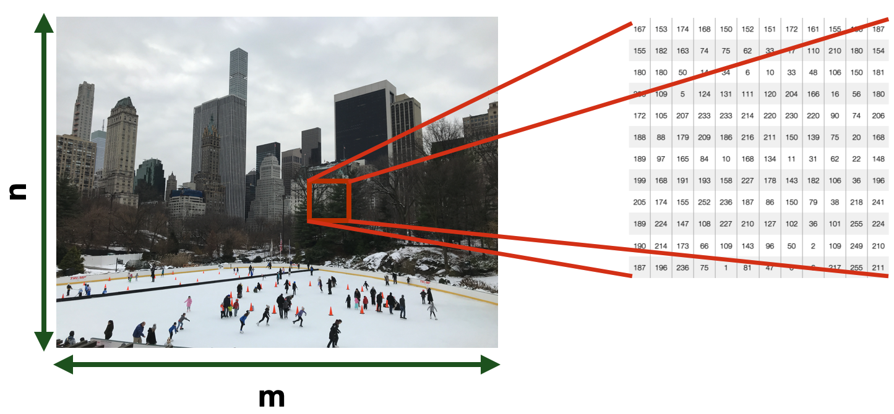

	- Each pixel in an image is a *feature*
		- numerical
			- 0 or 1 for *Black and White*
			- Between 0 and 255 for *greyscale*
			- 16M values for *RGB*
	- Dimensionality -> *n x m*

Image Types
Binary Images contain pixels that are either black (0) or white (1).
Grayscale Images have a wider range of intensity than black and white. Each pixel is a shade of gray with pixel values ranging be- tween 0 (black) and 255 (white).
Color Images have multiple color channels; each color image can
be represented in different color models (e.g., RGB, LAB, HSV). For example, an image in the RGB model consists of red, green, and blue channel. Each pixel in a channel has intensity values ranging from 0-255. Please note that this range depends on the choice of color model. A 3D tensor usually represents color images (Width x Length x 3), where the 3 channels can represent the color model such as RGB (Red-Green-Blue), LAB (Lightness-A-B), and HSV (Hue-Saturation- Value).

---

### Computer Vision
	Building algorithms that can “understand” the content of images and use it for other applications 
	- It is a “Strong AI” problem
		- signal-to-symbol conversion
		- The **semantic gap**

	A general-purpose vision system **requires**
	- Flexible, robust visual representation
	- Updated and maintained 
	- Reasoning
	- Interfacing with attention goals, and plans

---

### What specific tasks can we train a CV system to perform?

---

Background: media/true

---

Background: media/true

---

---

Background: media/true

---

Background: media/true

---

---

---

---

Background: media/true

---

---
	[Project Sunroof](https://www.google.com/get/sunroof)

---

Background: media/true

---

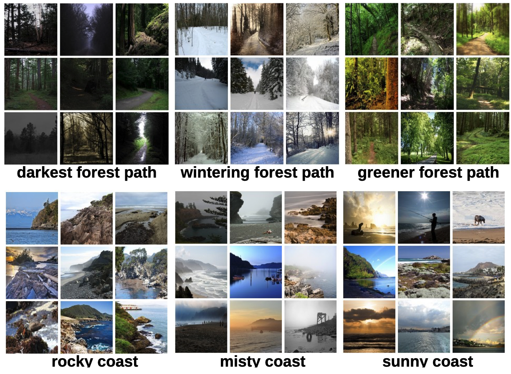

---

Background: media/true

---

Background: media/true

---

Background: media/true

---

Background: media/true

[Ethical task tracking of operators in agile manufacturing](
http://resolver.tudelft.nl/uuid:3408e8c3-809b-436d-94eb-efb4f0532b17)

---

#### Stereolabs ZED Camera
	[3D Object Detection](https://www.stereolabs.com/docs/object-detection/)
	[Body tracking](https://www.stereolabs.com/docs/body-tracking/)
	Positional tracking

---

Movie: Shallow Hal

---

Background: media/true

---

# Machine Learning for Design
	Lecture 3
	Machine Learning for Images. *Part 1*

Version 0.9
Date: 18/02/202
Author: Alessandro Bozzon
---
#### Credits
	[CMU Computer Vision](http://16385.courses.cs.cmu.edu/spring2022/) course - Matthew O’Toole. 
	Grokking Machine Learning. Luis G. Serrano. Manning, 2021

