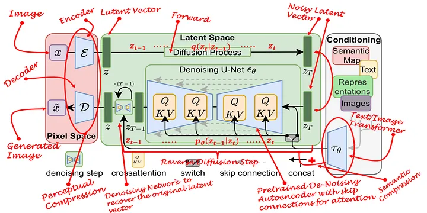

# Lecture 4: Lecture Notes

Version 0.7
Date: 07/03/2023
Author: Alessandro Bozzon

---

## How do humans see?

Vision is one of the ways humans perceive the world. Visual perception, at its most basic, is the act of observing patterns and objects through sight or visual input. Visual perception relates visual input to a previously existing *understanding* of the world, as constructed through previous experience and learning.  Over 50 percent of the processing in the human brain is dedicated to visual information. This fact alone should give a good feeling of how difficult it is to replicate biological vision with a computer. Computer vision has not been solved in 50 years and is still a very hard problem. 

---

	### Hubel and Wiesel, 1959

In 1962, Hubel & Wiesel[^1 David H Hubel and Torsten N Wiesel. Receptive fields, binocular interaction and functional architecture in the cat’s visual cortex. The Journal of Physiology, 160(1):106–154, 1962] set up an experiment to study the optical system of a cat. They recorded neurons while showing bright lines to a "wired" cat. They found that some specialized neurons fired only when the line was in a particular spot on the retina or if it had a specific orientation. If you open [this video](https://www.youtube.com/watch?v=IOHayh06LJ4) and turn up your volume, you can listen to the neuronal activity of the cat's visual cortex.

The experiments by Hubel and Wiesel are cornerstones of our understanding of how neurons along the visual pathway extract increasingly complex information to construct an image. Their research spearheaded a whole discipline devoted to the understanding of how the human visual system work. And, in 1981, they were awarded the Nobel Prize in Physiology and Medicine for their work. 

---

### Neural Pathways

Picture from https://nba.uth.tmc.edu/neuroscience/m/s2/chapter15.html

At the highest level, vision systems are pretty much the same for humans, animals, insects, and most living organisms. A visual system is built of two fundamental components. A **sensing device** - your eyes, and an **interpreting device**, your brain. 

The eye captures the light coming through the *iris* and projects it to the *retina*. The retina contains specialized light-sensitive receptors that convert the image into spatially distributed neural activity in the first neurons of the visual pathway. Stimulus features (e.g. color, brightness contrast, movement) are processed (in parallel) at all levels of the visual system and recomposed by the simultaneous activation of large areas of the visual cortex, which resides at the back of your head. The visual cortex is roughly organized as a hierarchical series of *layers* where the neurons in each layer communicate their activations to neurons in the next layer. 
Through their experiments, Hubel and Wiesel discovered that neurons in different layers act as *detectors* that respond to increasingly complex features appearing in the visual scene: neurons at initial layers become active in response to *edges*; their activation feeds into layers of neurons that respond to *simple shapes* made up of these edges, and so on.

Note that as the complexity of the recognized patterns grows, different regions of the brain (the **interpreting device**) get activated, to associate **meaning** to the visual information, and connect it to one's knowledge and understanding about the world.  

This is a relatively simplified description of how the visual system works. An important note: in reality, the visual system does not only have *feed-forward* pathways - i.e. flow of information from the eye to the brain. There are also many more (ten times more) *feed-backward* connections - from the brain to the lower layers -  whose role is not well understood by neuroscientists. The current hypothesis is that our prior knowledge and expectations about the world, as stored in higher brain layers, can strongly influence what we perceive. The sentence "seeing what we want to see" might have a literal meaning. 

---

### Neural Correlation
#### of Objects & Scene Recognition

The pictures in the slide show how different areas of the brain gets "activated" based on the shown visual stimuli - for instance, a face, an object, or a scene. 

Hubel and Wiesel’s discoveries inspired a Japanese engineer named Kunihiko Fukushima, who in the 1970s developed one of the earliest deep neural networks, dubbed the *cognitron*, and its successor, the *neocognitron*.

---

## Why is machine vision hard?

---

### The deformable and truncated cat

---

Background: media/true

What’s so hard about computer vision? Scientist (long time ago) believed that vision would be an easy problem to solve. There’s this famous AI [memo](https://dspace.mit.edu/handle/1721.1/6125) from Seymour Papert, who in 1966 proposed a summer vision research project with interns to basically solve computer vision over a period of a few months. Clearly, he severely underestimated the task at hand.

Consider the problem of getting a computer program to *recognize* cats in photographs. 

If the input is simply the pixels of the image, then the program first has to figure out which are “cat” pixels -- that is, pixels that contain visual information about the cat -- and which are “non-cat” pixels, that is, pixels containing information about the background, shadows, or other objects. 

However, cats are very interesting creatures, aren't they? They look very different: they can have diverse coloring, shapes, and sizes. This means that the collection of pixels associated with "cats" may vary a lot from image to image. When taking a picture of them, cats can be facing in various directions; the lighting can vary considerably between images; parts of the cat can be blocked by other objects (for example, fences, and people). Cats are deformable [^1 [The Truth About Cats and Dogs](https://www.robots.ox.ac.uk/~vgg/publications/2011/Parkhi11/parkhi11.pdf)]
What’s more, “cat pixels” might look like “dog pixels” or other animals. Under some lighting conditions, a cloud in the sky might even look very much like a cat. 

---

Background: media/true

All these representational variations make the problem of recognizing objects in computer vision very difficult. The image in the slide comes from a now classic paper [Strike (with) a Pose: Neural Networks Are Easily Fooled by Strange Poses of Familiar Objects](https://arxiv.org/pdf/1811.11553.pdf). As the title entails, the paper shows how non-canonical poses of common objects can easily fool a neural network. 

---
### Computer Vision Challenges

In the following slides, we summarise and explain some of the main challenges that computer vision systems need to address. Note that all of these challenges are present **at the same time**. Solving one might not necessarily help solve all the others. 

---

#### Viewpoint Variation
	A single instance of an object can be oriented in many ways to the camera.

Let us take, as an example, the task of recognizing objects in an image. Depending on the viewpoint, the 2D representation of a 3D object might dramatically change, despite this being the same object. Depending on the viewpoint, the pixels change dramatically.

---

#### Deformation

	Many objects of interest are not rigid bodies and can be deformed in extreme ways.

The same is true for *deformation*. Many objects (and animals, like cats) are not rigid. This means that they can be deformed in ways that, when captured in a picture, will create collections of pixels that are completely unique. 

---

#### Occlusion

	The objects of interest can be occluded. Sometimes only a small portion of an object (as little as a few pixels) could be visible.

Sometimes only a relatively small portion of an object can be visible. For instance, because it is cost out of the image, or because it is *occluded* by another object. In the picture, the cat is occluded by a wall.  

---

#### Illumination Condition
	The effects of illumination are drastic on the pixel level.

Look at the pictures in the slide, can you recognize what they show? The scene is the same but illuminated by different lights. Depending on where the light is projected, our understanding of the scene changes dramatically, as the organization of the pixels in the image. But it is exactly the same scene, pictured under the same viewpoint. This is to show that there is an intricate interplay between materials and light that give rise to a lot of different images despite showing exactly the same scene.

---

#### Scale variation

	- Visual classes often exhibit variation in their size
		- Size in the real world
		- Size in the image

Variations of the size of the object to be recognized also matter. Objects of the same class in the real world can have different sizes - there are small and big cats, various sizes of autos, etc. However, also the size of an object in the image matters. Small things in images are captured by fewer pixels. This means there is less visual information to use when recognizing them. 

---

#### Background clutter

	 The objects of interest may blend into their environment, making them hard to identify.

The recognition of an object in an image can be made more difficult by "visual distractions", that is the background or elements of the image such as patterns, textures, colors, shapes, or other objects that are visually similar to the object of interest or that overlap with it in some way.

---

#### Intra-class variation
	 - The classes of interest can often be relatively broad, such as chairs. 
	 - There are many different types of these objects, each with their appearance.

Finally, a big challenge is a variation in the object itself. Objects within the same class (e.g., cats, dogs, chairs, tables) despite having the same nature or functionality, might look very different. To distinguish a cat from a dog, for instance, a computer vision system has to be able to solve the problem that despite many cats looking different, they are part of the same category. We call this the *intra-class variation* (intra = within) problem.  
Of course, there is also an issue with the sheer number of object categories that exist in the world -- it is estimated that there are between *ten thousand* to *thirty thousand* high-level object categories. Of course, the number immediately increases as soon as the categorisation becomes more fine-grained. [ImageNet](https://www.image-net.org/), a popular computer vision dataset, contains  more than 20,000 categories with a typical category consisting of several hundred images. 

---

## How CV models work?

Images are made of pixels, and, in computer vision machine learning models, the more straightforward approach is to use the pixel values directly **input features*. 

Here we need to take a small diversion and introduce two concepts: *similarity* in a representation space; and the *manifold hypothesis*, an essential assumption at the basis of machine learning research. 

*Similarity* refers to the degree of resemblance or closeness between two objects or data points in a given feature space. Intuitively, this could be described with the idea that "cat pictures" have similar pixels distribution because cats look similar. We saw in the previous section that this might not be the case; however, with enough pictures of diverse enough cats (in diverse enough lighting conditions, etc.), a basic assumption in machine learning is that it is possible to create a "decision boundary" that identifies cats in that feature space. Whether this assumption is realistic or not depends, of course, on the amount, diversity, and quality of the available training data. 

One of the characteristics of high dimensional data (e.g., images in a dataset) is that the number of dimensions is comparable to, or larger than, the number of samples. The *Manifold Hypothesis* states that real-world high-dimensional data lie on low-dimensional manifolds embedded within the high-dimensional space. The hypothesis is based on the idea that high-dimensional data is often redundant (i.e., not all the dimensions used to represent a data item contain helpful information), and only a few underlying factors or features determine the structure and patterns in the data. Due to the manifold hypothesis, many data sets that appear to require many variables to describe initially can be described by a comparatively small number of variables. The Manifold Hypothesis explains why machine learning techniques can find useful features and produce accurate predictions from datasets that have a potentially large number of dimensions (variables). The fact that the actual data set of interest actually lives on in a space of low dimension means that a given machine learning model only needs to learn to focus on a few key features of the dataset to make decisions. 

We will not discuss these two concepts further. However, it is important for you to keep in mind that  *similarity* and the *manifold hypothesis* are essential concepts and assumptions in machine learning.

---

### Course of dimensionality
	- High dimensionality
		- A 1024×768 image has d = 786432! 
		- A tiny 32×32 image has d = 1024
	- Decision boundaries in pixel space are extremely complex
	 - We will need “big” ML models with lots of parameters 
		- For example, linear regressors need   d parameters

The number of pixels (hence, the number of features) can become too big for a machine-learning model to handle. Presume you have a 1MB image, where each pixel is represented by a single byte (0..255 value). At 1MB, you have one million pixels. That would require an input vector of 1,000,000 elements. And let's assume that the input layer has 1024 nodes. The "update and learn" weights would be over a billion (1 million x 1024) at just the input layer! You can imagine the computational complexity of optimizing 1 billion parameters after only the first layer. This number will increase drastically when we have tens or hundreds of layers. Even if in the news you can read of ML models with 200 or 300 billions of parameters, clearly, this is a number that cannot be easily handled. 

Therefore, the first step after preprocessing the image is to simplify the image by 1) reducing its color complexity (e.g. transforming it into black and white); 2) resizing the image to make it smaller; 3)  extracting the vital information (features) and throwing away non-essential information. Each one of these techniques can be applied in conjunction. Modern ML techniques based on deep learning only require resizing of the images, keeping color information, and not requiring any feature extraction. 

---

### Downsampling

**Downsampling** is the task of reducing the resolution of an image, to make it more tractable from a computational perspective. It is common in CV applications to reduce images to 1024x1024 resolution, or even 512x512. 

Downsampling allows for faster learning and processing time, but it also comes at a disadvantage. By reducing the image resolution too much, it is possible to lose the ability to distinguish what's in the image clearly.  

---

### Flattening

In computer vision applications, we deal with images or video. A picture can be represented as a 2-dimensional matrix, a grid of pixels. 

However, machine learning approaches typically deal with input data organized in arrays (sets or lists) of features. For instance, the input layer of a Neural Network is an array of numerical values of size $d$. 

**Flattening** is placing each row of the image matrix in sequential order into a vector. So the vector starts with the first row of pixels, followed by the second row of pixels, and continues by ending with the last row of pixels. 

This simple transformation has a significant consequence: *any spatial relationship between the pixels is lost*! This means that contiguous pixels in the array might not be close in the original image. As we will see, modern computer vision techniques can overcome this slight but essential distortion introduced by a mere technical requirement. 

Note that flattening is not **always** used as the first step in a machine-learning approache. As we will see later, Convolutional Neural Networks allow keeping the matrix format of an image, and even retaining colour information. The feature flattening happens later in the network.

---

### The “old days”: Feature Extraction
	- **Feature**
		- A relevant piece of information about the content of an image
		-e.g. edges, corners, blobs (regions), ridges
	- **A ==good== feature** 
		- Repeatable
		- Identifiable
		- Can be easily tracked and compared
		- Consistent across different scales, lighting conditions, and viewing angles
		- Visible in noisy images or when only part of an object is visible
		- Can distinguish objects from one another

A *feature* in machine learning is an individual measurable property or characteristic of an observed phenomenon. Features are the input you feed to your machine learning model to output a prediction or classification. Selecting good features that clearly distinguish your objects increases the predictive power of machine learning algorithms.

In computer vision, a feature is a measurable piece of data in your image that is unique to that specific object. A CV feature is a group of connected pixels with some common property. It may be a distinct color or a specific shape, such as a line, edge, or image segment. 

Features are useful to "compress" information. The input image has too much extra information that is unnecessary for classification. Therefore, the first step after preprocessing the image is simplifying it by extracting the important information and throwing away nonessential information. By extracting, for instance,  important colors or image segments, complex and large image data can be transformed into smaller sets of features. This makes classifying images based on their features simpler and faster.

A good feature is used to distinguish objects from one another. For example, if we consider a feature like a *wheel*. Clearly, that feature is more likely to be associated with the class "motorcycle" than the class "dog". A *wheel* is a strong *identifiable* feature that clearly distinguishes between motorcycles and dogs. However, the same feature will probably not be strong (*identifiable*) enough to distinguish a motorcycle from a bicycle. For that purpose, more features are needed, like a mirror, license plate, or maybe a pedal. 

A good feature is also *repeatable*, i.e., it should be useful to represent a class of objects, not a single one. For instance, the visual representation of a *wheel* should not be a single image's exact copy of a wheel. Still, it should be generic enough to represent many motorcycle wheels (see the image at the bottom). So, it should look like a circular shape with some patterns that identify wheels in all images in the training dataset. 

Good features should also be easy to *compute*, to *track* and *compare*. If a feature is complex to calculate, or it is very brittle to comparison, then it will probably not be very useful to the machine learning model. 

Finally, an idea feature is also *consistent* across different conditions (sales, lights, viewing angle) and *robust* to noise and occlusions. 

---

### The “old days”: Feature Engineering
	- Machine learning models are only as good as the features you provide
	- To figure out which features you should use for a specific problem
	 - Rely on domain knowledge (or partner with domain experts) 
	 - Experiment to create features that make machine learning algorithms work better

Before the era of deep neural networks, computer vision required spending a lot of time in manual feature selection and engineering. 

**Feature engineering** relates to manipulating and transforming data into a format that optimally represents the underlying problem that an ML algorithm is trying to model and mitigates inherent complexities and biases within the data.

In this process, the ML engineer relied on domain knowledge -- potentially partnering up with domain experts -- to create features that make ML algorithms work better. 

The features are in specific locations of the images, such as mountain peaks, building corners, doorways, or interestingly shaped patches of snow. These kinds of localized features are often called *keypoint features* (or even corners) and are often described by the appearance of patches of pixels surrounding the point location. The features that can be matched based on their orientation and local appearance (edge profiles) are called *edges* and they can also be good indicators of object boundaries and occlusion events in the image sequence.

These features are used as input to machine learning algorithms like (fully connected) neural networks or random forests for classification, that is to learn the correlation between such features and the prediction class. 

---

### Feature Extraction Techniques 

In this course, it is impossible to cover the whole field of features engineering for computer vision - there is literature going back thirty years. I will, however, describe some examples. 

**Histograms of oriented gradients** (HOGs) is an example of a feature extraction technique commonly used for object recognition tasks. HOG focuses on the object's shape in the image by attempting to quantify the gradient (or magnitude) and the orientation (or direction) of the edges of an object. HOG calculates gradients and orientations in broken-down, localized regions of the image and calculates a histogram of gradients and orientations to determine the final feature values. 

Another technique is the **Scale Invariant Feature Transform** or SIFT. The SIFT descriptor is invariant to translations, rotations, and scaling transformations in the image domain. It is also robust to moderate perspective transformations and illumination variations. 
---

### Performance

Credits: Ross Girshick (Facebook AI Research)

Feature engineering and "old" style feature extraction techniques have been the foundation of computer vision for many years. And while advancements were consistent, they never reached a level of performance that allowed for wide-scale applications. 

Convolutional Neural Networks changed everything. 

---

### Convolutional Neural Networks

	- CNNs exploit image properties to reduce the number of model parameters drastically
	- Feature maps
		- Automatically extracted hierarchical 
		- Retain spatial association between pixels
	- Local interactions
		- all processing happens within very small image windows
		- within each layer, far-away pixels cannot influence nearby pixels
	- Translation invariance
		- a dog is a dog even if its image is shifted by a few pixels

Convolutional Neural Networks (CNN) drive today’s deep-learning revolution in computer vision and other areas. CNNs were first proposed in the 1980s by the French computer scientist Yann LeCun, inspired by Fukushima’s neocognitron. The design of CNN is based on several key insights about the brain’s visual system that were discovered by Hubel and Wiesel. 

CNNs allow for eliminating Feature Engineering, as the network can be used both for feature learning and classification.

ConvNet consists of a sequence of layers of perceptrons. Perceptrons in each layer provide input to perceptrons in the next layer. Just like the neural network, when a ConvNet processes an image, each perceptron takes on a particular activation value - a number that is computed from the unit’s inputs and their weights. Weights are randomly initiated and learned during network training. The difference between a fully connected neural network and a CNN is the use **convolutional layers** instead of regular fully connected layers for feature- learning. 

A **convolutional layer** is the core building block of a convolutional neural network. Convolutional layers act like a *feature finder* window that slides over the image pixel by pixel to extract meaningful features that identify the objects in the image. 

Layers are *locally connected*. This means that nodes in the layer are connected to only a small subset of the previous layers’ nodes - for instance, pixels in the input image. This way, filters are applied only on close-by pixels without being influenced by far-away ones. This allows filters to be more focused, preserve local spatial relationships, and reduce the overall computational cost. 

A **feature map** is the output of one filter applied to the previous layer. It is called a feature map because it maps where a certain feature is found in the image. CNNs look for features such as *straight lines*, *edges*, or, in the deeper layers, even objects. Whenever they spot these features, they report them to the feature map. 

CNNs allow for *translation invariance* for images fed through the network. This means that the network can recognize patterns (or shapes) that are shifted or slightly warped within images.

Notice that the image dimensions shrink after each layer, and the number of feature maps (the layer depth) increases. Conceptually, you can think of this set of consecutive convolutional layers as the neural network learning to represent more abstract features of the original image.

The output of the feature extraction step is then flattened to a vector of the learned features of the image. Notice that the image dimensions shrink after each layer, and the number of feature maps (the layer depth) increases until we have a long array of small features in the last layer of the feature-extraction part. 
The flattened feature vector is fed to the fully connected layers (a traditional fully-connected neural network) to classify the extracted features of the image.

---

### Convolution & Feature Maps

Each convolutional layer contains one or more **convolutional filters**. The number of filters in each convolutional layer determines the depth of the next layer because each filter produces its feature map (convolved image). 

In mathematics, *convolution* is the operation of two functions to produce a third modified function. In the context of CNNs, the first function is the input image, and the second is the convolutional filter. In the slides figure (left), the convolutional filter (also called a **kernel**) is the 3x3 matrix that, by sliding over the input image, breaks the image into little chunks and processes those chunks individually to assemble the modified image, a **feature map** (right). 

Not that in CNNs, convolution matrixes are **the weights**. This means the network learns its values during training. 

Try this: https://cs.stanford.edu/people/karpathy/convnetjs/demo/mnist.html

---

### What CNNs learn?
	[Deep Visualization Toolbox](https://www.youtube.com/watch?v=AgkfIQ4IGaM)

https://yosinski.com/deepvis

---

### Feature Visualisation

In the following slides and pictures, we will give an impression of what a CNN learns through its convolutional layers

---

#### Layer 1

For instance, the first layer of the CNN consists of edge-detecting units. 

Visualizing and Understanding Convolutional Network. Zeiler and Fergus, ECCV 2014
---

#### Layer 2

The second layer can recognise more complex patterns and shapes.  

---

#### Layer 3

While the third layer can now capture the visual representation of more "abstract" concepts, like faces, or wheels. 

---

### Network Dissection

This images is taken from the [Network Dissection](http://netdissect.csail.mit.edu) dataset and related papers. It shows how specific concepts are "learned" by different CNN architectures. 

---

### Translation Invariance

	 But not rotation and scaling invariance!

Remember, CNN allows for *translation* invariance. That is, they can recognise features (e.g. a wheel) even if it appears in different positions of an image. They are, however, **not** *rotation or scaling invariant*. Objects that are rotated or scaled w.r.t. their representation in the training data might not be recognized. 

---

### What about generalisation?

As we often repeated, one of the main challenges in ML is to give the model the ability to *generalise* beyond the training data. However, if a CNN (or any network architecture) does not offer rotation or translation invariance, what could be done? 

The answer is in **data augmentation techniques**. 

---

### Data Augmentation

	- Generate variations of the input data
		- To improve generalisability (out of distribution inputs)
		- Improve invariance (rotation, scaling, distortion)

Data augmentation means expanding the training dataset with modified versions of the current images. Scal- ing, flipping, rotations, and other affine transformations are typically used to enlarge your dataset and expose the neural network to various variations of the training images. Alternatively,  *color space augmentations* (photometric transformations), random cropping, or noise injection allow the network to be more robust and makes it more likely that your model will recognize objects when they appear in any form and shape.

---

### Data Augmentation

	- Geometric
		- Flipping, Cropping, Rotation, Translation, 
	- Noise Injection
	- Color space transformation
	- Mixing Images
	- Random erasing
	- Adversarial training
	- GAN-based image generation

A good survey on state-of-the-art data augmentation techniques is: [A survey on Image Data Augmentation for Deep Learning. Shorten, Journal of Big Data, 2019](https://journalofbigdata.springeropen.com/articles/10.1186/s40537-019-0197-0).

---

### Robustness to input variation

Let's keep in mind that, despite all these attempts to extend the training datasets through data augmentations, computer vision models like CNN are still very brittle to variations of objects (and their representation) in images. The paper [Strike (with) a Pose: Neural Networks Are Easily Fooled by Strange Poses of Familiar Objects. Alcorn et al. 2019.](https://arxiv.org/pdf/1811.11553.pdf) describes this problem, although I encourage you to try using a tool like Teachable Machine. 

---

### Transfer Learning

	- **Problem**: training custom ML models requires extremely large datasets
	- **Transfer learning** : take a model that has been trained on the same type of data for a similar task and apply it to a specialised task using our own custom data. 
		- **Same data**: same data modality. same types of images (e.g. professional pictures vs. Social media pictures)
		- **Similar tasks** : if you need a new object classification model, use a model pre-trained for object classification

Transfer learning is one of the most important techniques of deep learning. Building a vision system to solve a specific problem requires collecting and label a vast amount of data to train your network. But what if this is not possible? 

Transfer learning is the transfer of the knowledge (feature maps) that the network has acquired from one task, where we have a large amount of data, to a new task where data is not abundantly available. 
The idea behind transfer learning is to utilize the weights and layers from a model trained in the same domain as your prediction task. In most deep learning models, the final (fully connected) layer contains the classification label or output specific to your prediction task. With transfer learning, we remove this layer, freeze the model’s trained weights, and replace the final layer with the output for our specialized prediction task before continuing to train. 

Transfer learning is also frequently applied in image object detection, image style transfer, image generation, text classification, machine translation, and more. Transfer learning works because it allows to utilize models already trained on extremely large, labeled datasets. 

However, the transferability of features depends on the similarity of the training and new datasets. This is especially true for later layers: the deeper the network layers, the more image-specific the learned features.

The idea is that all images must have shapes and edges, so the early layers are usually transferable between different domains.

---

## Advanced Computer Vision Techniques

---

### Generative Adversarial Networks

	- Learn patterns from the training dataset and create new images that have a similar distribution of the training set
	- Two deep neural networks that compete with each other
		- The **generator** tries to convert random noise into observations that look as if they have been sampled from the original dataset
		- The **discriminator** tries to predict whether an observation comes from the original dataset or is one of the generator’s forgeries

Although the earlier examples are truly impressive CV applications of AI, this is where I see the real magic happening: the magic of creation. In 2014, Ian Goodfellow invented a new DL model that can imagine new things called generative adversarial networks (GANs). The name makes them sound a little intimidating, but I promise you that they are not. A GAN is an evolved CNN architecture that is considered a major advancement in DL. So when you understand CNNs, GANs will make a lot more sense to you.

GANs are sophisticated DL models that generate stunningly accurate synthesized images of objects, people, and places, among other things. If you give them a set of images, they can make entirely new, realistic-looking images. For example, StackGAN is one of the GAN architecture variations that can use a textual description of an object to generate a high-resolution image of the object matching that description. This is not just running an image search on a database. These “photos” have never been seen before and are totally imaginary (figure 1.9).

The GAN is one of the most promising advancements in machine learning in recent years. Research into GANs is new, and the results are overwhelmingly promising. Most of the applications of GANs so have far have been for images. But it makes you wonder: if machines are given the power of imagination to create pictures, what else can they create? In the future, will your favorite movies, music, and maybe even books be created by computers? The ability to synthesize one data type (text) to another (image) will eventually allow us to create all sorts of entertainment using only detailed text descriptions.

Without a doubt, one of the most important advances in the last few years has been the development
of generative adversarial networks, or GANs. Generative adversarial networks have shown
fascinating results when it comes to image generation. GANs consist of two competing networks,
the generator and the discriminator. The generator attempts to generate real-looking images,
whereas the discriminator tries to tell the real images and the fake images apart. During the
training process, we feed real images to the discriminator, as well as fake images generated by the
generator. When applied to a dataset of human faces, this process results in a generator that can
generate some very real-looking faces

In addition to generating new images, GANs can be used in applications such
as text-to-photo synthesis, image-to-image translation, image super-resolution,
and many other applications.

---

	- The **generator**’s architecture looks like an inverted CNN that starts with a narrow input and is upsampled a few times until it reaches the desired size

	- The **discriminator**
	’s model is a typical classification neural network that aims to classify images generated by the generator as real or fake

It is not the problem with the individual methods but the adversarial nature of the problem itself. Some of the major bottlenecks of the GANs are:
- Lack of diversity in Image Generation
- Mode Collapse
- Problem learning Multimodal distribution
- High Training Time
- Not Easy to Train due to the Adversarial Nature of the problem formulation

Deep Learning for Vision Systems. Mohamed Elgendy. Manning, 2020

---

### [Which face is real?](https://www.whichfaceisreal.com/)

Try this: https://thispersondoesnotexist.com/

---

### Image super-resolution GAN

	- [A good technical summary](https://blog.paperspace.com/image-super-resolution/)

Image Super-Resolution refers to the task of enhancing the resolution of an image from low-resolution (LR) to high (HR)

---

### Text-To-Image Generation

Credits: https://github.com/CompVis/latent-diffusion

---

	Prompt: "*A dream of a classroom full of interested *XXX* students*"

	#### ==Design==

	#### ==CS==

A **text-to-image** model is an example of a generative ML model where the input is a **text prompt**, and the output is an image *matching* the text.

A dream of a classroom full of interested ==design== students. Realistic, matte painting, HQ, 4k

https://beta.dreamstudio.ai/dream

https://beta.dreamstudio.ai/prompt-guide
---

	- ML-generated painting sold for $432,500
	- The network trained on a dataset of 15,000 portraits painted between the fourteenth and twentieth centuries
	- Network “learned” the style, and generated a new painting

https://en.wikipedia.org/wiki/Edmond_de_Belamy

---

https://towardsdatascience.com/what-are-stable-diffusion-models-and-why-are-they-a-step-forward-for-image-generation-aa1182801d46

https://arxiv.org/pdf/2011.13456.pdf

A standard Diffusion Model has two major domains of processes: Forward Diffusion and Reverse Diffusion. In a Forward Diffusion stage, image is corrupted by gradually introducing noise until the image becomes complete random noise. In the reverse process, a series of Markov Chains are used to recover the data from the Gaussian noise by gradually removing the predicted noise at each time step.

Diffusion Models have recently showed a remarkable performance in Image Generation tasks and have superseded the performance of GANs on several tasks such as Image Synthesis. These models have also been able to produce more diverse images and proved to not suffer from Mode Collapse. This is due to the ability of the Diffusion Models to preserve the semantic structure of the data. However, these models are highly computationally demanding, and training requires a very large memory and carbon footprint which makes it impossible for most researchers to even attempt the method. This is due the fact that all Markovian states need to be in memory for prediction all the time which means multiple instances of large Deep-Nets being present in memory all the time

You may ask why can the VAE compress an image into the much smaller latent space without losing information? The reason is, unsurprisingly, natural images are not random. They have high regularity: A face follows certain spatial relationship between eyes, nose, cheek and mouth. A dog has 4 legs and in a certain shape.

In other words, the high dimensionality of images are artifactual. Natural images can be readily compressed into the much smaller latent space without losing any information. This is called the manifold hypothesis in machine learning.

---

### Image-to-Image Generation

Video from: https://github.com/CompVis/latent-diffusion

The technique where an entity in the pictured is substituted is called "Inpainting"

We also see examples of super-resolution

---

### Synthetic Video Generation

	Generated from [Synthesia.io](https://www.synthesia.io)

---

### Neural Style Transfer

Neural style transfer, one of the most interesting CV applications, is used to transfer the style from one image to another. The basic idea of style transfer is this: you take one image—say, of a city—and then apply a style of art to that image—say, The Starry Night (by Vincent Van Gogh)—and output the same city from the original image, but look- ing as though it was painted by Van Gogh (figure 1.8).

Neural style transfer is an optimization technique used to take two images—a content image and a style reference image (such as an artwork by a famous painter)—and blend them together so the output image looks like the content image, but “painted” in the style of the style reference image.

This is implemented by optimizing the output image to match the content statistics of the content image and the style statistics of the style reference image. These statistics are extracted from the images using a convolutional network.

https://fluxml.ai/experiments/styleTransfer/

it is possible with a pre-trained neural network to take a real image
and a painting and then produce an image that is demonstrating the content of the real image but in the style
of the painting. And there's a really nice website where you can try this yourself with your own photographs.

This is where conditioning comes in. The purpose of conditioning is to steer the noise predictor so that the predicted noise will give us what we want, after subtracting from the image.

---

https://replicate.com/rinongal/stylegan-nada

---

### Deep Fakes
	[Very realistic Tom Cruise Deepfake](https://www.youtube.com/watch?v=iyiOVUbsPcM)

Deepfakes (combination of Deep Learning and fake) are a form of synthesized media that were created using
Deep Learning techniques. The name originates from a GitHub repository2 that focuses on swapping face in
photos and videos. Deepfakes can also be used create other forms of media, e.g. the audio of a persons voice

In contrast, Facial Reenactment is a technique which takes an expression from a video or image and
animates it on another person (see Fig. 165). The output is a manipulation of the expression of a person.
Reenactment techniques yield large potential in the animation and movie industry. Classical techniques require
tedious 3D model creation and manual editing. Machine Learning could automate this process and enable richer
editing, or updating scenes without re-shooting them.
Another example of facial reenactment is Face2Face [52] (see Fig. 166). The goal is capture the facial
expression from a source RGB-input and map it on a person in a target video. All of this is done in real time
with a commodity webcam for the source input. The method uses a face model to track the expression of
the faces in the target and source video. The parameters of this face model are recovered by dense non-rigid
alignment. The expressions in the target and source video are tracked which enables the transfer of the facial
expressions.

---

# Machine Learning for Design
	Lecture 4
	Machine Learning for Images. *Part 2*

Version 0.7
Date: 07/03/202
Author: Alessandro Bozzon
---

#### Credits
	[CMU Computer Vision](http://16385.courses.cs.cmu.edu/spring2022/) course - Matthew O’Toole. 
	Grokking Machine Learning. Luis G. Serrano. Manning, 2021
	[[CIS 419/519 Applied Machine Learning]](https://www.seas.upenn.edu/~cis519/spring2020/). Eric Eaton, Dinesh Jayaraman. 
	Deep Learning Patterns and Practices - Andrew Ferlitsch, Maanning, 2021
	Machine Learning Design Patterns - Lakshmanan, Robinson, Munn, 2020
	Deep Learning for Vision Systems. Mohamed Elgendy. Manning, 2020

