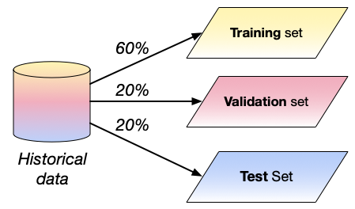
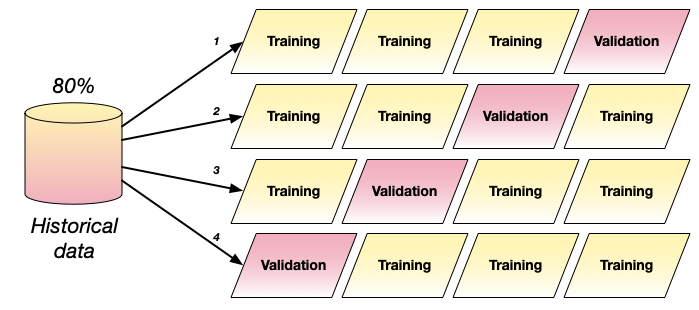
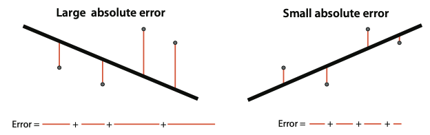
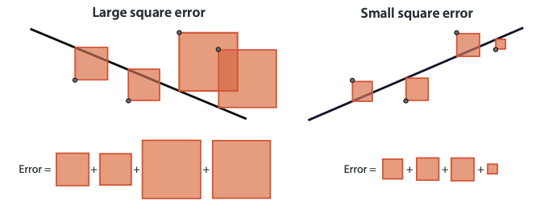
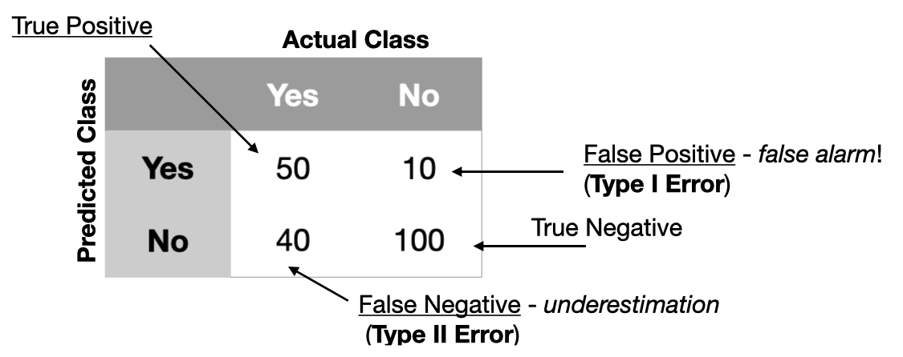
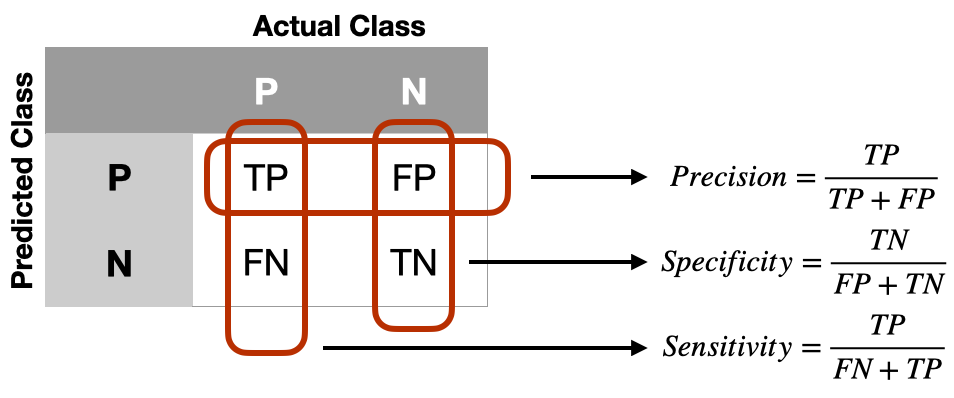

# Lecture 5a: Training and Evaluation. Lecture Notes

Version 1.0
Date: 18/03/2023
Author: Alessandro Bozzon

---

## Previously on ML4D

---

### CRISP-DM Methodology

In Lecture 2, you were introduced to the [CRISP-DM methodology: Cross Industry Standard Process for Data Mining](https://www.the-modeling-agency.com/crisp-dm.pdf), a way to describe the process of Machine Learning system development. Three phases in that process are of interest to us in this lecture: 
- In the **modeling step**, the actual machine learning model is trained. This step begins once the problem to be solved is defined and the data is prepared.
- In the **evaluations** step, the development team checks how the developed model complies with the expected performance requirements. 
- In the **deployment and monitoring** step, the machine learning model is put "in production," facing real users. There, the model encounters "the real world", dealing with data items never experienced before during training and evaluation. 

These three steps are independent but entirely connected. Therefore, we will look at them again, describing them through a slightly different lens. 

---

## Model Development Lifecycle 

---

The diagram in the slide *unpacks* three **CRISP-DM** steps described before and highlights the **data** used in each stage and the **actions** performed. 

The data available beforehand are called *historical data*. This emphasizes how such data represent and encode the past phenomena that the ML algorithm will try to predict. 

In the **modeling phase**, developers use two disjoint (i.e., no data items in common) subsets of the historical data: the *training set* and the *validation set*. 
As the name suggests, the *training set* is used to train the machine-learning model - that is, given the chosen class of models (e.g. a neural network), learn the model's parameters that can achieve better prediction performance. 
Once the model is trained, the *validation set* is used for validation purposes. This means, for instance, "tuning" the model based on the performance of that different set of data. 
The tuning is needed for several reasons. 
- The first is to look at the model's performance against a different data set. As we will see in a later lecture, machine learning models can become too good at learning a given data distribution (this is called *overfitting*) at the cost of generalisation performance (showing good performance with unseen data items). If there is a substantial difference in the model performance over the training and validation sets, then probably some early choices need to be reconsidered. For instance, a deep neural network might be too complex a model for the problem. 
- The second reason concerns selecting the best models and learning *hyperparameters*. As you remember from the previous lecture, models can be configured -- e.g., the number of layers in a deep learning architecture, and the complexity of a linear regression model. Likewise, learning algorithms like gradient descent have hyperparameters like the learning rate or the number of training epochs. Tuning the model entails determining the optimum parameters for the model, called hyperparameters, that give the best performance. 
The validation step is an iterative process, that continues until the developer is satisfied with the achieved level of performance.

In the **evaluation phase**, the learned model is tested against another subset of *historical data* called the *test set*. The *test set* is also disjoint from the *training( and *validation* sets. 
The objective of the **evaluation phase** is to obtain an unbiased assessment of the model's performance. The lack of bias, in this case, comes from the fact that the *test set* is entirely unknown to the model, thus mimicking the situation that could occur in the real world. In reality, the data in the *test set* are still *historical data*, so they have probably been created in the same conditions as the training and validation data. Therefore, the evaluation is not completely unbiased. 
The evaluation phase can (and *should*) also include stakeholders and experts so that they can also evaluate the model's performance before being put into production. This additional testing is called **user acceptance testing** (UAT), and is supposed to be the final stage in the development of any software system. Unsatisfactory performance requires returning to the modeling phase or earlier to the **data preparation** or the **problem specification** stages. 

If the performance is satisfactory, the process moves to the **deployment and monitoring** phase. The model is run against *new data items* produced by the system's end users. If these data items are sufficiently similar to the *historical* ones, then the model should perform well. It is possible, however, that these new data items are different enough to yield unsatisfactory performance. This is almost inevitable due to a phenomenon called *concept drift*. 
*Concept drift* occurs when the properties or the distribution of the data fed to the deployed model *changes* compared to the *historical data*. This could happen when the historical data did not contain examples of a specific class. The (in)famous example of the Tesla Autopilot [confusing the moon for a traffic light](https://www.youtube.com/watch?v=7UF-S2czdCk) is representative of this class of issues. 
Concept drift can also happen when classes exist in the historical data, but the properties of items belonging to such classes change over time, thus leading to increasingly worse performance. For example, consider a machine learning model trained to classify news articles into categories like “politics,” “sport,” and “technology.” Suppose the model is trained on news articles from the 20th century. In that case, its performance on current data will probably be bad: terms like “smartphone” were perhaps not present back then, thus predicting the "technology" category very hard. 
To mitigate these issues, it is essential to continually update the training dataset and retrain the models accordingly. This is why any decently designed ML system should include a **monitoring** step, where feedback from users or predictions are collected and analysed to provide new training data for the system and then allow its improvement over time. 

---

## Dataset Splitting

---

### Split your data 

	- **Training** set
		- *train*
	- **Validation** set
		- *fine-tune*
	- **Test** set
		- *evaluate*

A quick discussion on the issue of dataset splitting. As explained in the previous section, training and evaluating a machine learning model based on historical data requires splitting such data into a *training*, *validation*, and *test* set. But how should this data be split? 

From a numerical perspective, the idea is always to reserve more data for the training than for the evaluation phase. So, an 80-20 strategy (80% for training and validation, 20% for testing) is very common. The proportion can vary slightly, also based on the abundance of the available data. Remember that machine learning models need a lot of data for good training, so the more data available for training the better. 

But quantity is not the only issue. How data items are distributed is also important. Imagine a computer vision dataset for object classification containing 10 categories of items. Intuitively, the 10 classes should be present in the *training*, *validation*, and *test sets*, otherwise performance will be worse, for instance, for those classes that received no training. However, this is not sufficient, as it is essential to make sure that the number of items per class (their distribution) is proportionally similar. In the example above, the training set should contain a similar percentage of each category of items as the test and validation sets. This will maximise the chances that the developed model reflects and is being evaluated in real-world scenarios - at least insofar as the historical data contains a good reflection of the world to be modeled. 

---

### Avoid ==leakages==

	- **Data items**
		- in the *validation* or *evaluation* sets
	- **Features** 
		- highly correlated to prediction
		- not present in the production environment 

Keeping a proportion of the data is insufficient, as there could be some subtle issues in how the data is distributed across the three sets. A specific type of issue is the so-called **data leakage**, which is the presence of data items in the **training** set leak into the **validation** or **evaluation** sets. If this happens, then it would be like training the model to "cheat the test," as training data are more likely to be recognized by definition. 

Data leakage can also happen when features in the training, validation, and test sets unintentionally leak information that would otherwise not appear in deployment when the model performs predictions on new data. A famous example of data leakage happened during the [KDD Cup Challenge](https://www.kdd.org/kdd-cup/view/kdd-cup-2008) of 2008. The goal was to create a machine-learning model based on X-ray images to detect whether a breast cancer cell was benign or malignant. The model with higher performance used a feature called *Patient ID*, the identifier generated by the hospital for the patient. [It turned out](http://kdd.org/exploration_files/KDDCup08-P1.pdf) that some of the hospitals that provided the data used the patient ID as a way to indicate the severity of the patient's condition *when they were admitted to the hospital*, thus creating an association between the feature and the expected result of the x-ray analysis of the patient when they were admitted to the hospital, which, therefore, leaked information about the target variable.

---

### Cross-validation

	- Cycle training and validation data several times
		- Useful when dataset is small
	- Split the data into $n$ portions
		- Train the model $n$ times using $n-1$ portions for training 
		- Average results 

How could data be spliced between the *training set* and the *validation set*? Simply partitioning the data (e.g., 60% for training and 20% for validation) is an option. However, remember that at training time, the goal is to achieve good performance and generalize as much as possible. So, the more data items are explored for training and validation purposes the merrier. 

*Cross-validation* is an approach where the historical data allocated for training and validation are randomly partitioned into $N$ sets of equal size, and the learning algorithm is also run $N$ times. Each time, one of the $N$ sets is used as a validation set, and the model is trained on the remaining $N−1$ sets. The score (error) of the model is evaluated by averaging the error across the $N$ validation errors. In the slides, we can see an example where the available historical data is split in 4 batches. In this way, it is possible to create 4 training set up, each with a different *validation* set. 

The advantage of cross-validation techniques is their conceptual simplicity, the disadvantage is the high computational cost resulting from many repeated training trials. If the computational cost of training a model is high, cross-validation could be expensive.
Moreover, as the training dataset is reduced, it is important to make sure that there is sufficient training data so that all relevant phenomena of the problem exist in both the training data and the validation data.

Note that a similar approach can also be used for the creation of the *test* dataset. 

---

## Evaluation

---

### How to Evaluate?
	
	- **Metric**
		- How to measure errors?
		- Both training and testing
	- **Training**
		- How to “help” the ML model to perform well? 
	- **Validation** 
		- How to pick the best ML model? 
	- **Evaluation**
		- How to “help” the ML model to generalize?

How can the evaluation of Machine Learning systems be performed? And, most importantly, what is evaluated?  

We have seen in the previous slides the roles that the *training* and *evaluation* steps play in the engineering of an ML model. Evaluation during *training* is primarily devoted to creating a model that performs best on the training data; or selecting the best model or configuration. During the *evaluation* step, the additional goal is to assess if the model performs acceptably in the chosen application domain, possibly by including end users or other stakeholders. 

In both cases, what is needed is a way to measure the performance of a model mathematically. 

---

### Let errors guide you 

	- Errors are almost inevitable!
	- How to measure errors?
	- Select an evaluation procedure (a “metric”)

Machine learning systems are stochastic. This means that, in practice, they will **always** make some mistakes. The goal is, of course, to minimize such mistakes, and this is what we try to get a machine learning model to do: **minimize mistakes**. Or minimise the errors they make. 

---

### Model Training Process

In Lecture 3, we described in simple terms what, in practice, the training of a machine learning model is: find the best model's parameter values that **minimize** a given prediction error (or prediction cost). 

---

### Errors
	
- These are the most common questions:
	- *How* is the prediction wrong?
	- *How often* is the prediction wrong?
	- What is the *cost* of wrong predictions?
	- How does the *cost* vary by the wrong prediction type?
	- How can *costs* be minimised? 

How can a good metric (or error functions) be selected? The answer to this question requires a deep and precise analysis of the *cost* associated with an error. Here by *cost* we do not only mean monetary cost, although money can always be an issue. *Cost* can also be interpreted as the **harm** that could be done to the people on the receiving side of a prediction. It is possible, for instance, that the wrong classification of an offensive document brings discomfort to the user of an online video service. The wrong classification of an chest scan can have far worse consequences.

---

### Regression

How do we measure errors in regression problems?

---

#### Mean **absolute** error

$MAE= \frac{1}{N}\sum^N_{J=1}|p_j - v_j|$

Average of the difference between the *expected* value ($v_j$) and the *predicted* value ($p_j$)

In a previous lecture, we have already been introduced to the concept of *error* in regression: the difference between the *expected* value $v_j$ and the *predicted* value $p_j$.

**Mean Absolute Error** averages the error made by the model on every data point in the training set (if the Mean Absolute Error guides the training), in the validation set (if it is used during validation), or in the evaluation set. 
It is called the **absolute** error because it is calculated over the *absolute* value of the difference: the difference can be positive (the model predicts a higher value) or negative (the model predicts a lower value). To turn this difference into a number that is always positive, we take its absolute value.

---

#### Mean **square** error

$MSE= \frac{1}{2N}\sum^N_{J=1}(p_j - v_j)^2$

- Average of the square of the difference between the *training* value ($v_j$) and the *expected* value ($p_j$)
- Square is easier to use during the training process (derivative)
- More significant errors are more pronounced

The **Mean Square Error** is very similar to the absolute error, but what is calculated is the **square** of the difference between the predicted and expected values. The result will always be a positive number. The square error is used more commonly in practice than the absolute error for two reasons: 1) the square has a much nicer derivative than an absolute value, which is useful when using the gradient descent algorithm for training; 2) it "amplifies" the value of large errors, making them more prominent in the error function. 

---

### Classification

And what about classification? 

---

#### Confusion Matrix

Describes the complete performance of the model

In classification models, the classification can either be **correct** or **not correct** - it is impossible to be "sort of" correct. Therefore, errors are described and calculated differently from *regression*.

Let us use the example of a *binary* classifier that works only on two classes. For instance, *yes* and *no* (as in the slide), *sick* or *not sick*, *cat* or *dog*. 
In this case, errors can only be of two types: 
- **False Positive** (FP): a data point with a negative label that the model classifies as positive. For instance, a healthy person (*not sick*) who is incorrectly diagnosed as *sick*. 
- **False Negative** (FN): a data point with a positive label that the model falsely classified as negative. For instance, a *sick* person is incorrectly diagnosed as *not sick*. 

Of course, we also have: 
- **True Positive** (TP): data points with a positive label correctly classified as positive. For instance, a healthy person classified as *not sick*.
- **True Negative** (TN): data points with a negative label correctly classified as negative. For instance, a sick person correctly diagnosed as *sick*.

A **Confusion Matrix** helps keep track of these four quantities. In binary classification models like the one in our example, the confusion matrix has two rows (the predicted classes) and two columns (the actual class). Cells contain the number of time the model produces **True Positives**, **True Negatives**, **False Positives**, and **False Negatives**. In confusion, the correctly classified data items are counted on the diagonal, and the incorrectly classified data items are counted off the diagonal. Note that sometimes rows and columns can also be transposed, but the meaning of TP, TN, FP, FN remains the same. 

In classification settings with more classes, the confusion matrix is larger. Consider, for example, a model classifying patients as *sick*, *not sick*, and *unsure*; then the confusion matrix is a three-by-three matrix. 

---
#### Type I and Type II errors

In literature, it is also possible to find **False Positives** and **False Negatives** respectively described as **Type I** and **Type II** errors.

---

#### Accuracy

$\frac{TP+TN}{TP+TN+FP+FN}$

- The *percentage of times* that a model is correct
- The model with the highest accuracy *is not necessarily the best*
- Some errors (e.g., False Negative) can be more costly than others

**Accuracy** is the simplest and the most common measure of classification models, and it calculates the percentage of times a model is **correct**. Its value is calculated as the ratio between the number of correctly predicted data points and the total number of data points. 

Note that in this formulation, **Accuracy** treats each data points in the dataset equally: there is no data point for which a mistake is worse than others. Also, accuracy does not consider if items belonging to a specific class are more popular than items belonging to another class. In this situation, a model can achieve a very high accuracy score because it performs well on the most popular class items. Take, for instance, a problem where 99% of the data items are in one class (e.g. *not sick*) and only 1% are in the other class (e.g., *sick*): a model that **always** predicts *not sick* will achieve a 99% accuracy, thus appearing to be very good, while in reality being very problematic for the 1% of the population that needed the model to work. 

---

#### Errors are not equal

Also, accuracy treats **errors** as *equally costly*. In the example above, making a mistake on the 1% of the population (that is, classifying them as *not sick* even if they are *sick*) is a problem. The images in this slide provide real-world examples of situations where classification errors made for rare or unknown classes can have very dire consequences. 

---

- Detecting the “Alexa” command?
- Pregnancy detection
	- Cost of “false negatives”?
	- Cost of “false positives”?
- Covid testing
	- Cost of “false negatives”?
	- Cost of “false positives”?
- Law enforcement?

Depending on your task, different errors have different costs. Consider the examples in the slide. 
What are the costs associated with mistaking an *Alexa* command? The cost of a *false negative* is probably meagre for the end user. In the worst case, the user must repeat the command or stop using *Alexa* altogether. A *false positive* can be more tricky, as *Alexa* can start processing the input, thus believing that an instruction must be executed. In a [funny example](https://qz.com/880541/amazons-amzn-alexa-accidentally-ordered-a-ton-of-dollhouses-across-san-diego), it is reported that during a broadcast, the TV anchor Jim Patton said, “I love the little girl saying, ‘Alexa, order me a dollhouse.’” In households with an Alexa device listening, Alexa mistook the statement as a request to order a dollhouse. Here the cost of the mistake is not high, but several users had to rush to cancel orders placed on their devices, and Amazon had to explain how something like that was possible in the first place. 

What about the cost of errors in the case of a pregnancy test? Here a *false positive* (or a *false negative) will probably give a big scare or a big hope (depending on whether the people involved wanted or not to conceive a child), but a second test or a proper visit to the doctor will probably remove any doubt. 

In the case of a COVID test, things are a bit trickier. A *false negative* could give *sick* people the freedom to circulate and further spread the virus. In March 2023 this was not such a big issue anymore, but in March 2020 it was. A *false positive*, on the other hand, will probably force someone to stay at home (or work from home) even if they feel perfectly ok. 

One critical remark: no matter how good a metric can be, it can always be *fooled*. The decision on what metric to use is **a design choice**, which should be driven by an understanding of the costs of errors (false positive vs. false negative).  Never assume that a model is good before evaluating it against different metrics. 

---

#### Balanced Accuracy

$\frac{\frac{TP}{TP+FN}+\frac{TN}{FP+TN}}{2}$

- Average of single class performance 
- Good to use when the distribution of data items in classes is imbalanced

The **Balanced Accuracy** is a way to measure accuracy by accounting for the accuracy value of each class. The formula of the Balanced Accuracy calculates the average of each class's accuracy. Note that the accuracy of a single class is equivalent to the **recall** for that class (we will see the formula for recall in a couple of slides). 

When the dataset is *unbalanced*, i.e., one or more classes have a significatively smaller number of data items,
the **Accuracy** value mainly depends on the algorithm's performance with the most popular classes. The **Balanced Accuracy** gives smaller classes the same influence on the formula then the more popular ones, although their
size is reduced in the number of data points. This means that **Balanced Accuracy** is insensitive to an imbalanced class. This can be an advantage when interested in having good prediction also for under-represented classes. But it can be a disadvantage if the goal is to have good prediction on the entire dataset.

If dataset is quite *balanced*, i.e., the classes have a balanced number of data items, **Accuracy** and **Balanced Accuracy** have similar values. 

---

#### Balanced Accuracy Weighted

$\frac{\frac{TP}{(TP+FN)*w}+\frac{TN}{(FP+TN)*(1-w)}}{2}$

- **Weighted** average of single-class performance 
- Weight depends on the popularity of a class.

The **Balanced Accuracy Weighted** extends the **Balanced Accuracy** formula by multiplying each class's accuracy by the class frequency ($w$) on the entire dataset. 
In this way, larger classes have a weight proportional to their size. 

Since class accuracy is weighted by the class frequency, **Balanced Accuracy Weighted** can be a very good 
performance indicator with classification algorithms working on many classes. 

---

#### Precision

$\frac{TP}{TP + FP}$

- Among the examples we classified as positive, how many did we correctly classify?

The **Precision** is the fraction of True Positive predictions divided by the total number of positively predicted data items (True Positive plus False Positive). **Precision** is a metric that tests the correctness of the Positive data items that are correctly classified. With Precision, we are interested in minimizing the number of **False Positives** the model predicts because such mistakes can be costly.  Consider the example of a pregnancy test. A test with too many false positives will probably be undesirable because it would overflow the healthcare system with people that did not need to be controlled during an actual pregnancy -- not to mention the undesired emotional effect for people that wanted a pregnancy bit did not have one, or for those that did not want a pregnancy, and are now very upset about it. 
Not that very high precision can be achieved by a system that rarely (or never) predicts a positive value - thus making, by definition, no mistakes. Yet, that model will probably be useless. 

#### Recall

$\frac{TP}{TP + FN}$

- Among the positive examples, how many did we correctly classify?

The **Recall** is the fraction of True Positive elements divided by the number of positively classified units (True Positive plus False Negative). **Recall** is a metric that tests the proportion of all the Positive data items that were supposed to be positively classified. **Recall** is a useful metric when in the considered applications **False Negatives** are costly. Take the example of a COVID-19 test during the early phases of the pandemic. Arguably, the most important thing was to find all the infected people worldwide, even if that meat misdiagnoses some non-infected people. Note that a model that diagnoses every patient as *sick* can be very bad: despite having zero False Negative patients, it can have too many False Positives. 

---

#### $F_1$ -Score

$F_1 = 2 * \frac{1}{\frac{1}{P}+\frac{1}{R}}$

- The harmonic mean between *precision* and *recall*
- What is the implicit assumption about the costs of errors?

**Precision** and **Recall** measure two performance properties that are both of importance. It can be helpful to be able to combine them both. For example, we can be interested in an ML model that does not misdiagnose *sick* patients but does not misdiagnose too many healthy (*non sick*) people -- e.g., when the wrong diagnosis of a healthy person may involve unnecessary and painful testing. 

The $F_1$ score combines both recall and precision. If both **precision** and **recall** are high, then the **F_1** score is also high. However, if one is low, then the **F_1** score will also be low, thus indicating that one of the two is not at the desired level. 
Note that the *harmonic mean* is not the same as the *average*, although it is always smaller or equal to it. The reason for not using a simple average is that a simple average would balance the excellent performance of one metric with the lousy performance of another. For example, a system with 90% precision and a 10% recall will have a simple average of 50%, which might be misleading. The harmonic mean (the $F_1$ score) is 18%. 

---

#### Sensitivity (true positive rate)

$\frac{TP}{FN + TP}$

- Identification of the positively labeled data items
- *Same as recall*

In the medical field, **Sensitivity**  is used to identify the positively labeled data items, and it is the same as **Recall**.

---

#### Specificity (false positive rate)

$\frac{TN}{FP + TN}$

- Identification of the negatively labeled data items
- *Not the same as precision*

**Specificity** is another metric used in the medical field to focus on **negatively labeled data points**. Note that **Specificity** is not the same as **Precision** because the focus is on the negative data items.  

---

This table summarises how **Sensitivity** (**Recall**), **Specificity**, and **Precision** are calculated. 

---

#### Medical Test Model

- **Recall** and **sensitivity**
	- How many were correctly diagnosed as sick among the sick people (positives)? 
- **Precision**
	- Among the people diagnosed as sick, how many were sick? 
- **Specificity**
	- Among the healthy people (negatives), how many were correctly diagnosed as healthy? 

Let us discuss the three measures in the case of a medical test like in the COVID-19 example. As we mentioned before, in this case, we are more concerned about correctly diagnosing sick people so we would need a model with **high sensitivity** (or high **recall**). 

---

#### Spam Detection Model

- **Recall** and **sensitivity**
	- How many were correctly deleted among the spam emails (positives)?  
- **Precision**
	- Among the deleted emails, how many were spam?  
- **Specificity** 
	- Among the good emails (negatives), how many were correctly sent to the inbox?

Let us consider another example: a model that classifies *spam* emails and deletes them from a mailbox. 
With this model, the **sensitivity** (**recall**) is the proportion of spam messages (positive class) that were correctly deleted among all the spam messages. The **specificity** is the proportion of good emails (negative class) that were correctly sent to the inbox among all the good emails. In this case, the application requires the model to have **high specificity**, as wrongly classifying mails as **spam** can be a big issue. 

---

#### Search Engine

- Constraint: **high precision**
	- False positives are tolerable but should be minimised
- Among the available models, pick one with a higher recall
	- **Metric**: *Recall at Precision =* $x$*%*

In a final example, let us consider a search engine. In this case, the goal of the application is to retrieve the best possible set of pages at the top of the search results page. For this application **high precision** is important, although some mistakes can be tolerated. If there is the possibility of picking between different models, the suggestion is to pick the one with similar precision and higher recall. 

Note that dozens (if not hundreds) of metrics could be used to measure machine-learning models (for instance, the **Recall at Precision** mentioned in the slide. In this course, we will only look at few, but there will be many more that you can encounter in the follow-up courses in the master. 

---

### ==Metrics are also designed in a multi-stakeholder context==

- One team builds the mode
	- Data scientists / ML engineers 
- Many teams will make use of it
	- e.g., product team, management team

Chasing a metric is, of course, a critical and delicate design task. A task that often requires a design process involving several stakeholders. 

Though a single team is often responsible for building a machine-learning model (the data science / or ML team), many teams across an organization will have a stake in the model's performance. Each team will inevitably have its definition of *success** or *failure*, which could be at odds with one another. 

For instance, imagine a model that should identify defective products from images. The data science team wants to minimize standard accuracy metrics because it simplifies training. On the other hand, the product management team is more interested in reducing the number of defective products that are misclassified and sent to customers. Finally, the executive team might aim at minimizing the products that are misclassified as defective because that will lead at a revenue decrease. Each one of these goals has a different conceptualisation of *success*, and gives a different weight to *errors*. Balancing these differing needs within an organization can present a challenge. When defining the goals of a model, it is therefore important, as for many other design processes, to consider the needs of different teams across an organization and how each team’s needs relate to the model. 

---
#### Credits
	Grokking Machine Learning. Luis G. Serrano. Manning, 2021
	[[CIS 419/519 Applied Machine Learning]](https://www.seas.upenn.edu/~cis519/spring2020/). Eric Eaton, Dinesh Jayaraman. 
	Deep Learning Patterns and Practices - Andrew Ferlitsch, Maanning, 2021
	Machine Learning Design Patterns - Lakshmanan, Robinson, Munn, 2020

