# Lecture 5b: Natural Language Processing - Part a. Lecture Notes

Version 1.0
Date: 26/03/2023
Author: Alessandro Bozzon

---

## Previously on ML4D

---

### Natural Language Processing
	High-level understanding of the language spoken and written by humans
	Also, generation (e.g., ChatGPT)
	An enabler for technology like Siri or Alexa

In a previous lecture, we introduced *Natural Language Processing* (**NLP**), a sub-field of Artificial Intelligence and Machine Learning that analyses natural language (written or spoken) to understand its content. Or, more recently, to generate realistic text and voices. 

NLP technology can play several roles in the context of design. NLP is an enabling technology for products that base their interaction on natural language conversations—for example, popular personal assistants like Siri or Alexa or conversational systems like ChatGPT. 
NLP technology can support the design process, as it can help extract meaning from collections of textual documents and support its analysis, for instance, by automatically facilitating the thematic analysis of interview transcriptions.  

---

## Why natural language processing?

---

### Big Textual Data = Language at scale
	- One of the largest reflections of the world, a man-made one
	- Essential to better understand people, organisations, products, services, systems
		- and *their relationships*!

	- Language is a proxy for human behaviour and a strong signal of individual characteristics
		- Language is always situated 
		- Language is also a political instrument

Language is an essential component of social interaction, and written text is, in a way, the materialization of language. 
Text reflects our world, as captured by words, stories, and books. Through text, humans record their laws, report news and events, capture history, and express feelings and emotions. Companies and governmental organizations use text to communicate their values and intentions, through advertisements or public messages. Text is produced by people, and therefore an expression of their context, culture, and politics. Even text generated by machines (e.g. ChatGPT) is, in reality, the product of a process of selection of documents (for training), styles of response, and safety measures that embed a specific view of the world. 

Textual documents encode information about the world, which is why it has always been the object of study and interpretation. Scholars of history analyze text to understand the past and give interpretations to events for which little is left in our collective memory. Social scientists analyze text to study how groups of people interact, relate to each other, and understand and evolve their culture and their world. Companies are interested in understanding how consumers respond to advertisement campaigns, or how they appreciate (or criticize) their products and services. Governments analyze text data to understand the views of citizens on proposed policies, or the consent (or dissent) of the elected officials. 

Despite the ability to print text on a large scale, analysing an extensive collection of textual documents was impossible in the past. Reading large collections of documents was (and still is) very time-consuming and considered too daunting the task of manually organizing text into categories or tracking the presence or evolution of concepts of interest. 

The widespread availability of digital computing technologies, including personal computers (from the 90s), mobile computers, and the Web (from the 2000s onwards), changed everything. Text has been not only very easy to create and distribute; but thanks to the increasing computational power of digital devices, the processing and analysis of extensive text collections have been democratized.

Despite all the recent advances in NLP technology, it is a mistake to believe that the qualitative methods developed in the long tradition of the humanities and social sciences could be simply replaced. NLP technology should be considered a tool to **assist** and **augment** reading, analysis, and interpretation abilities.  

---

### Fora, social media

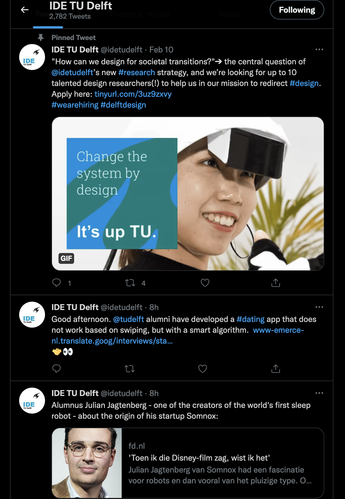

A quick list of common sources of textual content. 

Web pages, fora, and social media. They are incredibly broad sources of content that, despite their size, can suffer from issues of lack of diversity and bias. Size, it is important to remember, is never an intrinsic positive quality for a document collection - especially if there is homogeneity in the type of content, and in the people that wrote it. 

---
### Product review

Online e-commerce Websites like Amazon, eBay, and Alibaba are incredibly rich sources of information about products and services. Consumers spontaneously (most of the time) describe their experience and opinion with these products, creating input that could be very useful for companies to interpret the success (or failure) of particular commercial endeavors. 

---

### Books
	Digital, or digitised 

---

### Interviews

---

	- Answer questions using the Web
	- Translate documents from one language to another
	- Do library research; summarize
	- Archive and allow access to cultural heritage
	- Interact with intelligent devices
	- Manage messages intelligently
	- Help make informed decisions
	- Follow directions given by any user
	- Fix your spelling or grammar

	- Grade exams
	- Write poems or novels
	- Listen and give advice
	- Estimate public opinion
	- Read everything and make predictions
	- Interactively help people learn
	- Help disabled people
	- Help refugees/disaster victims
	- Document or reinvigorate indigenous languages

The slides list examples of tasks that could be performed through NLP technology. The list is far from complete, but it should give you an indication of how broad could be the application of NLP technology in your work. As next text analysis methods emerge (e.g. large language models), it becomes cheaper and more accessible to use NLP methods both to design and in designs. 

---

## What is Natural Language Processing?

---

	- ==Computer using natural language as input and/or output==
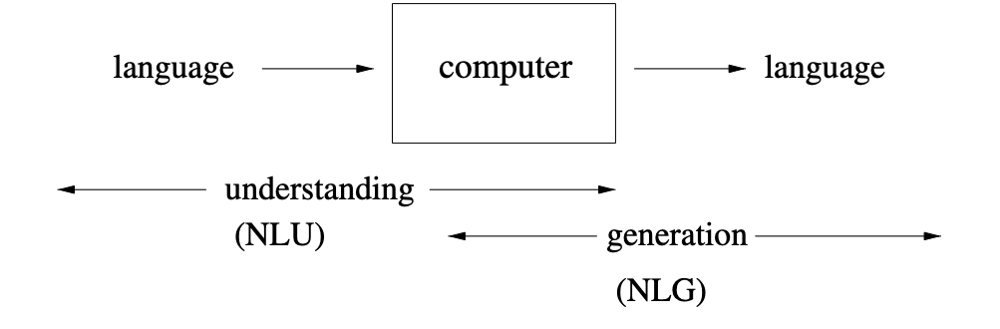

	- **N**atural: human communication, unlike e.g., programming languages
	- **L**anguage: signs, meanings, and a code connecting signs with their meanings
	- **P**rocessing: computational methods to allow computers to `understand’, or to generate

Natural Language Processing uses computational methods to **understand** and **generate** language produced by humans to communicate with each other.  

As for any computational methods, NLP approaches attempt to reduce the complexity of language so that it can be captured mathematically and processed through computers. 

Language is a complex, multifaceted communication system used by humans to convey thoughts, ideas, emotions, and intentions. Language can take on various forms, including *spoken*, *written*, and *non-verbal* communication (such as gestures or facial expressions). Language consists of a set of *symbols* known as **phonemes** (in spoken language) and **graphemes** (in written language), which are combined according to specific rules to create meaningful units called **morphemes**, **words**, **phrases**, and **sentences**. These combinations form the basis of a language's **grammar**, which governs the structure and relationships between words and phrases, ensuring coherent and consistent communication.

---

	### Beyond keyword matching
	- Identify the **structure** and **meaning** of **words**, **sentences**, **texts** and **conversations** 
	- Deep understanding of broad language

One of the simplest text-based tools that (almost) everyone is accustomed to are *search engines* -- online, like *Google*, or on a computer, like *Finder* on a Mac. Search engines, in their original yet most common versions, are *keyword-matching* systems: given a query composed of a sequence of words (keywords), they find documents that contain such words and order them according to criteria such as size, recency or relevance to the query. 

Natural Language Processing (NLP) technology offers more sophisticated approaches to understanding human language than simple keyword matching. Keyword matching falls short when dealing with the complexity and nuance inherent in human language. NLP encompasses a range of techniques and algorithms designed to tackle various linguistic challenges, enabling a deeper and more meaningful understanding of language. 

---

## Why is NLP Hard?

---

	Human languages are **messy**, **ambiguous**, and **ever-changing**

	A string may have many possible interpretations at every level 
	The correct resolution of the ambiguity will depend on the *intended meaning*, which is often inferable from the *context*

Human language is not easy to tame. As individuals, we can sustain even complex communications with colleagues, friends, and family. We understand the dialogs we hear in tv series and movies, and we (sort of) get what politicians tell us on TV. When we read a news item or a book, we comprehend what the writer is trying to say, evoke, and let us believe. But we are complex creatures, and our ability to communicate and understand language is both (to some extent) innate and acquired. We do not actively "learn" our mother tongue, but we literally grow into it. Through experience and imitation, we learn the association between words and visual, abstract, or emotional concepts. We possess a knowledge of the world - and its language representation - that helps us resolve possible ambiguity. 

When we learn a new language, we comprehend the intrinsic cognitive complexity of actively learning a language. However, we can rely on the knowledge of our mother tongue to create associations and analogies. We can associate the same meaning with different words (e.g., synonyms) or expressions without noticing. 

---

	There is tremendous **diversity** in human languages

	Languages express meaning in different ways
	Some languages express some meanings more readily/often

Language varies significantly across the world. Even if it appears that there exist some universal properties of languages, the way a language evolves and is used across communities, cultures, and countries is incredibly diverse. 

Languages express meaning in different ways. We capture the culturally-related subtleties of language as they are expressed through idioms and figures of speech. For instance, the Dutch expression "Dit varkentje wassen" means "getting things done" or "taking care of a problem." The idiomatic expression, literally translated, has no straightforward equivalent meaning in Italian, where washing pigs is not associated with having confidence in one's ability to complete a task or deal with a challenge. But *language evolves*, so maybe it will also be an Italian figure of speech.  
Some languages express some meanings more readily or more often. Think about how in a language like Italian, there are countless different names for *pasta* -- spaghetti, linguine, fettuccine, penne, rigatoni, lasagne, and farfalle, to name just a few. Each name captures different properties of the pasta itself, properties on how it should be cooked (a specific type of sauce or filling), but also some properties of the region and the tradition connected to such pasta. 

---

	**Knowledge Bottleneck**

	About language
	About the world: Common sense and Reasoning

All the complexity explained above cannot be captured by hard-coding rules over the presence or absence of keywords unless when working with a limited subset of a language and when addressing a minimal domain. This is why natural language processing is often said to be a **hard AI** problem: to process language at a human level, a computer system should be able to represent the world and acquire world knowledge. Just like a human does. 

---

### Ambiguity and Expressivity

Language is highly context-dependent, with the meaning of words and phrases often changing based on the surrounding context. **Ambiguity** is a common challenge in natural language understanding, as sentences can often be interpreted differently.

---

	> **Christopher Robin** is alive and well. **He** is the same person that you read about in the book, **Winnie the Pooh**. As a boy, **Chris** lived in a pretty home called **Cotchford Farm**. When **Chris** was three years old, **his father** wrote a poem about **him**. The poem was printed in a magazine for others to read. **Mr. Robin** then wrote a book 

	Who wrote **Winnie the Pooh**?
	Where did **Chris** live?

Take the example text in the slide, and try to answer the question: who wrote **Winnie the Pooh**? 

The text provides the answer, but implicitly. The text mentions the name *Christopher Robin*, but it is unclear if he is the person that wrote **Winnie the Pooh**, or by his father. We do not know if *Mr. Robin* is *Christopher Robin*; it is possible that *Christopher Robin* made a book after his father wrote a poem about him. To complicate things, *Christopher Robin* is also the name of a character in the **Winnie the Pooh** books. 
A quick online search will reveal that **Winnie the Pooh** was created by *Alan Alexander Milne*, the father of *Christopher Robin Milne*. *Christopher Robin Milne* is, coincidentally, also an author. 

---

#### Lexical ambiguity 
	The presence of two or more possible meanings within a single word

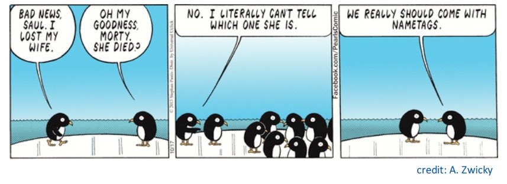

**Lexical Ambiguity** is the presence of two or more possible meanings within a single word. The context in which a term is used determines the intended meaning. For example, the word *lost* in the comic can mean *losing sight of* or *losing due to death*. Another example is the word *bank*, which could refer to a financial institution, the side of a river, or, in Dutch, to a couch. 

---

#### Syntactic ambiguity (**Word sense** ambiguity)
	The presence of two or more possible meanings within a *single sentence* or *sequence of words*

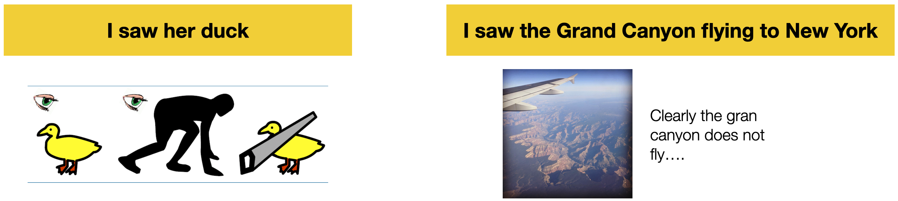

The syntax of a language is the set of principles under which sequences of words are judged grammatically acceptable by fluent speakers. Syntactic ambiguity occurs when a sentence can be **parsed** (*interpreted*) in multiple ways due to its grammatical structure. For instance, the sentence *I saw her duck* can be interpreted as *seeing a duck owned by a female person*, *seeing a female person lowering her head or body*, or *cutting a duck with a saw*. The sentence *I saw the Grand Canyon flying to New York* is another example. 

---

#### Attachment ambiguity 

	> The policeman shot the thief with the gun

The slide shows an example of **Attachment ambiguity**, a type of syntactic ambiguity that emerge when a word or phrase can be associated with more than one element in a sentence, leading to different interpretations. This ambiguity arises because it is unclear how a specific part of a sentence should be "attached" to the rest of the sentence in terms of its grammatical structure.

---

#### Pronoun Reference ambiguity

A **Pronoun Reference Ambiguity** (or Anaphoric Ambiguity) occurs when a sentence uses a pronoun to refer to an antecedent (a person or a thing) in an ambiguous way. Like in the funny example in the slide. 

Picture: https://www.printwand.com/blog/8-catastrophic-examples-of-word-choice-mistakes

---

#### Semantic Ambiguity

	> Every fifteen minutes a woman in this country gives birth. Our job is to find this woman, and stop her! 
		Groucho Marx

**Semantic Ambiguity** occurs when an expression is semantically ambiguous when it can have multiple meanings -- that is, there are different ways of reading the sentence.

Some [examples](https://cs.nyu.edu/~davise/ai/ambiguity.html):
- "John and Mary are married.": to each other? or separately?
  - Compare "John and Mary got engaged last month. Now, John and Mary are married." 
- "John kissed his wife, and so did Sam." Did Sam kiss John's wife or his own?

Other examples of ambiguity include: 
- **Idiomatic Ambiguity**: when a phrase or expression has a figurative meaning that differs from its literal interpretation. For instance, *break a leg*. 
- **Pragmatic Ambiguity**: when the intended meaning of a statement depends on the context, the speaker's intentions, or the listener's background knowledge. 

---

### Sparsity

---

#### Zip's Law
	> “... given some document collection, the frequency of any word is inversely proportional to its rank in the frequency table...”

*Zipf's Law* is an empirical law formulated to describe the frequency distribution of words in natural languages. The law has been empirically formulated by observing how in a document collection, the most frequent word will occur approximately twice as often as the second most frequent word, which occurs twice as often as the fourth most frequent word, etc. More formally, the law states that *the frequency of a word in a large corpus is inversely proportional to its rank in the frequency table*. 

Mathematically, Zipf's Law can be expressed as:

	$f(r) = c / r^z$

where:
- $f(r)$ is the frequency of a word with rank r
- $c$ is a constant specific to the language or text
- $r$ is the rank of the word in the frequency table
- $z$ is an exponent, usually close to 1. When a is $0$ the distribution is uniform. As $z$ increases, so does the skewness of the function. 

Zipf's Law holds for all languages )including non-natural ones like Esperanto) but it is yet to be understood why. Differences in languages are reflected by differences in $c$ and $z$ values. For instance, [empirical work](https://www.gelbukh.com/CV/Publications/2001/CICLing-2001-Zipf.htm) found that for English $z = 0.97 ± 0.06$ and for Russian $z = 0.89 ± 0.07$, the difference being 8.3%. Two properties of these languages might explain the difference: Russian is a highly inflective language (i.e., a language that changes the form or ending of some words according to factors such as the genders, noun cases, verb conjugations, verb tenses,  persons, moods, voices, aspects, numbers) while English is analytical (i.e., a language that uses specific grammatical words, or particles, and word orders rather than inflections). Second, it is well known that Russian lexical richness is greater than English.

---

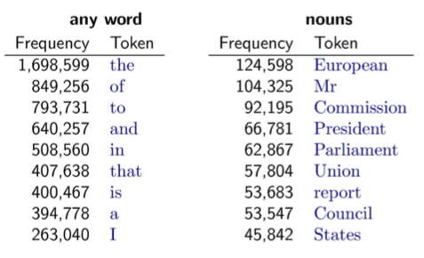

The figure shows an example of word distribution from a document collection belonging to the European Parliament. It is immediately possible to observe which words have high frequency: the ones that are very generic in the language (e.g., articles) and the ones that are very specific for a document collection (e.g. nouns specific to the application domain). 

Zipf's Law is handy in NLP because it can guide the choice of features for various NLP tasks. For instance, focusing on some of the most frequent words makes it possible to 1) capture the most important and relevant information (the right column in the slide) while 2) filter out less significant words or noise (the left column).

Zipf's Law can also inform the development of language models, as it provides a basis to estimate word probabilities. We will discuss language models in the following lecture. 

---

### Language Evolution

---

| --- | --- |
| **LOL** | Laugh out loud   |
| **G2G**   | Got to go   |
| **BFN**   | Bye for now   |
| **B4N**   | Bye for now   |
| **Idk**   | I don't know   |
| **FWIW**   | For what it's worth   |
| **LUWAMH**   | Love you with all my heart   |

Finally, NLP is hard because language evolves. For instance, humans invent new terms (neologisms and acronyms) daily. These new terms could be the result of an optimization process (e.g. [LOL](https://en.wikipedia.org/wiki/LOL) (Laugh out loud) is said to have been invented in the 80s in the context of pre-Web digital chat rooms. Neologisms are so common that linguists started curating collections to help track the evolution of the language. For instance, the website [Woordenboek van Nieuwe Woorden](https://neologismen.ivdnt.org/search) collects new words that appeared in the standard Dutch Language. Have you ever wondered when the expression *roast* (ridiculing someone for entertainment) entered the Dutch language? Look [here](https://neologismen.ivdnt.org/article/roast).
These terms become officially part of a language when included in dictionaries. For instance, *LOL* has been officially included in the *Oxford English Dictionary* in  2011.

---

And humans change the way they communicate in even more fundamental ways. Think about using [emojis](https://emojipedia.org) to indicate emotional state: emojis have their meaning, but they can also add meaning, clarity, and credibility to text. Emojis can also be interpreted in different ways, depending on the cultural and socio-economic background of the sender or the receiver. But also depends on the device in use (Emoji characters vary slightly between platforms).

---

## NLP Tasks

A product/service/system (or a designer) can use NLP techniques to process natural language text and draw valuable information from it. 

// CONSIDER MOVING IN LECTURE 1

NLP techniques could be used for: 
- **Discovery**, i.e., to create new conceptualizations or ways to organize the world, to support making sense of it. The conceptualization helps simplify some of the highly complex elements of the environment or situation you are exploring to focus your attention on one or a few specific aspects. For example, imagine you are interested in studying online reviews. What aspects of these reviews are essential for your analysis? For example, you could be interested in exploring
  - *Topical content*: What are the reviews about? The functionality of a product? Its aesthetics? Ergonomics?
  - *Sentiment*: Are users positive or negative about the product or one of its functionalities?
  - *Credibility* and *informativeness*: Are the review written and informative for your purpose, Or are they rant, probably created to mess with the reputation of a given vendor or product?
The text may contain some other relevant aspects you were unaware of, which might be captured by a different concept not in your original conceptualization of the world. 

- **Measurement**, i.e., the quantification of a given content in the data, to describe its prevalence in the real world. Given a concept, how prevalent is it in the data? Measurement is the essential ingredient for *description* as it provides valuable **summaries** of the data, which in turn may help characterize the state of the world, inform theories, or provide evidence for the success (or failure) of some design choices. 

- **Prediction**, i.e., to make predictions about events in the future - or the effect of an intervention - based on the discovered concepts and measures. For example, a designer could be interested in estimating how a given framing of a problem (or solution) could affect users' perception of (or engagement with) a product or a service. This is a predictive question because it uses today's information to help understand what will happen tomorrow. 

Note that these three activities are not to be conceptualised in isolation. As you know, it is very common (especially for designers) to discover new directions, theories, and measures as part of the design process. While this refinement and evolution process is supported by qualitative insights, (textual) data can also play an important role. 

---

### An example of NLP Process
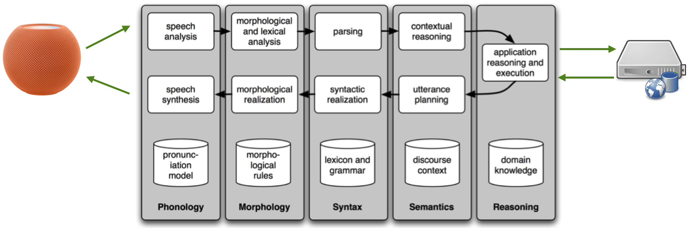

The one in the figure [^1 Bird, S., Klein, E., and Loper, E. (2009). Natural Language Processing with Python. O’Reilly.]  is an example of an NLP pipeline for a spoken dialog system, like the one you interact with an Apple (Siri), Amazon (Alexa), or Microsoft (Cortana) product. We introduce it because it summarises the many aspects of NLP that go into such products, touching both issues of natural language understanding and generation. 

Along the top of the diagram, moving from left to right is a “pipeline” (a sequence) of some **language understanding** components. This pipeline processes speech input (e.g., "Siri, how is the weather going to be in the coming hour?") to produce a meaningful representation of the utterance (e.g., the request is about the weather one hour from now). The reverse pipeline of components converts concepts back to speech to **generate language** that answers the question (e.g., "It will be raining"). These components make up the dynamic aspects of the system. At the bottom of the figure (and at the far right) are some representative bodies of information: the repositories of language-related data that the system uses in its work, but also remote systems, used to draw other data, or to invoke some remote business function. 

The pipeline addresses five fundamental steps of NLP: 
- **Phonology**, i.e., how the basic language units of sound (*phonemes*) are organized in a language. In an NLP pipeline, phonology may involve tasks such as *speech recognition*, *text-to-speech conversion*, and *text-to-speech conversion*. We will not address them in this course. 
- **Morphology**, i.e., how words are built up from smaller meaning-bearing units called morphemes. Two broad classes of morphemes can be distinguished: **stems** - the central morpheme of the word, supplying the primary meaning; and **affixes** - adding “additional” meanings of various kinds. For example, the word *cats* consists of the morpheme *cat* (stem) and of the morpheme *-s* (affix). 
- **Syntax**, i.e., how words are arranged together to form sentences. Syntax concerns how words are combined and ordered to create grammatically correct and coherent sentences. The syntax of a language (as described by its grammar) determines how specific types of words, like nouns, verbs, and adjectives, are organized in sentences. 
- **Semantics**, i.e., how words, phrases, and sentences convey meaning in various contexts
- **Reasoning**, i.e., drawing conclusions and making inferences based on the information available in a text
- 

---

### Morphology

In an NLP pipeline, morphological analysis typically involves tasks such as *tokenization*, *stemming*, and *lemmatization*. It is possible to extract word forms, inflections, and derivations by breaking down words into their constituent morphemes. This can improve the efficiency (speed) and effectiveness (quality) of text processing.

---
#### Tokenisation

	- Separation of words (or of morphemes) in a sentence 
	- Issues
		- Separators: punctuations 
		- Exceptions: „m.p.h“, „Ph.D“
		- Expansions: „we're“ = „we are“ 
		- Multi-words expressions: “New York”, “doghouse”

One of the first (and most common) steps in NLP processing is converting text into a standard form that is convenient for automatic processing - a task called **Text Normalisation**.

**Tokenization** is about breaking up a document into discrete words having their meaning. 

Tokenization is a language-specific problem, and each language poses unique challenges.

English words are often separated from each other by *whitespace*, but whitespace is not always sufficient. For instance, words like *New York*, *White House* and *rock ’n’ roll* must be treated as a single word despite containing spaces. Sometimes words must be separated: for instance *I’m* into the two words *I* and *am*. In these cases, more sophisticated approaches are needed. 

Using whitespace for tokenization is an approach that works for most languages. However, in languages such as Chinese and Japanese, words are not separated by spaces; the reader infers words from the context within the sentence. A *word segmentation model* is used to split the characters into their constituent words for these languages.

---

#### Stop-word Removal

	- Removal of high-frequency words, which carry less information
		- E.g., determiners, prepositions
	- English stop list is about 200-300 terms (e.g., *been*, *a*, *about*, *otherwise*, *the*, etc..)

When introducing Zip's law, we discussed how some words in a document collection are bound to be very frequent, depending on the language or the document collection itself. In NLP parlance, **stop-words** are words used across documents that do not give much information about a specific NLP task. In English, for instance, these are common words such as *and*, *the*, and *that*. These words account for a significant fraction of the words, but they account for only a tiny fraction of the meaning. By removing them, it is possible to reduce the size and complexity of the feature set that needs to be handled computationally. 

---

#### Lemmatisation
	It uses dictionaries and morphological analysis of words to return the base or dictionary form of a word 
	 Example: Lemmatization of *saw* —> attempts to return *see* or *saw* depending on whether the use of the token is a *verb* or a *noun*

Another part of text normalization is **lemmatization**, i.e. the task of determining that two words have the same root, despite their surface differences. For example, *family* and *families*; or *sang*, *sung*, and *sings* (different forms of the verb *sing*). They are distinct terms, but in some tasks, it may be effective to map them all to a common form. 

A **lemma** is the canonical form (such as one might find in a dictionary) of a set of words that are related by inflection (i.e., modifications due to case, number, tense, etc.). Lemmatization is the process of mapping words to their lemma. Sometimes identifying the lemma is relatively simple (e.g. *family* and *families*) but it can also be quite complex (e.g. *sing*, *sang*, *sung*). 

Lemmatization can be cumbersome because it often requires a *dictionary lookup* (to map *sung* to *sing*) and, sometimes, syntactic analysis to identify the role played by the word in the sentence (e.g. *saw* as a noun, or *saw* as the past tense of the verb *see*).

---

#### Stemming
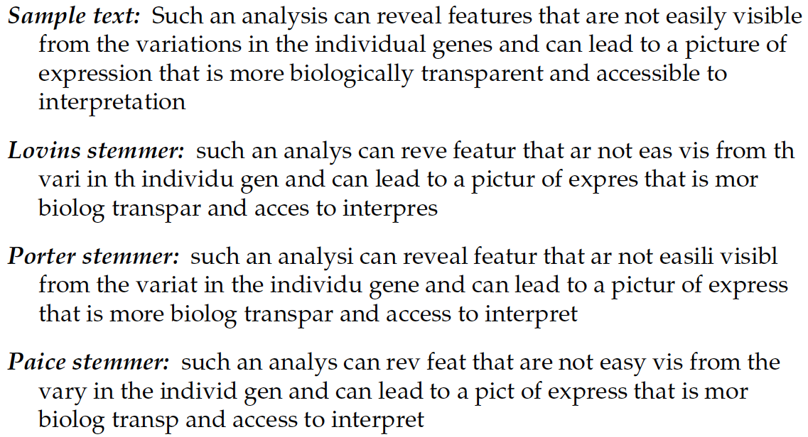

	- Heuristic process that chops off the ends of words in the hope of achieving the goal correctly most of the time
	- Stemming collapses derivationally related words
	- Two basic types: 
		- Algorithmic: uses programs to determine related words 
		- Dictionary-based: uses lists of related words 

A popular approximation to lemmatizing that also maps related forms together is **stemming**. 

**Stemming** uses simple algorithms (and sometimes dictionaries too) to discard the end of a word. In the case of *family*, all the variants would be mapped to *famili*. 

Stemming is often quite effective and substantially faster than lemmatization, but it produces words that are not actual in the language. Also, it fails to deal with words with more complex forms. Stemming can also sometimes reduce two words to a common stem with distinct meanings, such as *secure* and *securities*.

---

### Syntax

By understanding the syntactic structure of a sentence, NLP systems can decipher the relationships between words and phrases, which is crucial for various NLP tasks and applications.

---

#### Part-of-speech Tagging
	Tagging each word in a sentence with a corresponding *part-of-speech* (e.g. noun, verb, adverbs)

https://cloud.google.com/natural-language#section-2

A part of speech (POS) is a category of words with similar grammatical properties. In English, for example, **nouns** describe the *names of objects*, *animals*, *people*, and *concepts*, among many other things. **Verbs** describe *actions*, *states*, and *occurrences*. A noun can be used as a **subject**, or as an **object** of a verb. **Adjectives** describe properties (e.g. colour, age, visual quality) of nouns. **Adverb** modify verbs by indicating *time*, *place* or *manner* of a given action. The English language also has other classes of POS, including **Pronouns** (i.e., a shorthand for referring to an entity or event - e.g. *she*, *I*); **particles** (i.e. preposition-like form used together with a verb - e.g. *up*, *down*, *on*, *off*), **Punctuation**, **Numeral** and so on. 

**Parts of speech tagging** is the task of assigning a grammatical tag to each word within a document. Words are tagged either by a rule-based algorithm or by a machine learning algorithm that classifies each word based on a manually tagged training dataset.

POS tagging is an essential input to several other techniques and can be used to focus text processing on properties of interest. For example, if one is primarily interested in sentiment content, it may be advantageous to remove all parts of speech except adjectives and adverbs, which are more likely to convey cues about sentiment. POS tagging can also be used to identify phrases (or *n-grams*) that can be included in feature sets or to visualize texts. 
For example, it can be used to identify **noun phrases** (e.g. *Health Care*).

---

#### Language Analysis
	- Idea: people's language can provide *insights into their psychological states* (e.g. emotions, thinking style)
	- For instance
		- Frequency of words associated with positive or negative emotions
		- Use of pronouns as a proxy for confidence and character traits 

It is a common intuition among scholars (but also laypeople) that how we use language (i.e., word choices or figures of speech used; sentence structure; and register or tone) gives out subtle clues about what the people uttering (or writing) they are like, psychologically speaking.

**Language analysis** explores how authors/writers/speakers convey meaning through specific language analysis techniques.

Language analysis attempts to infer a person’s psychology by mapping out the content of what they said: for example, charting a user’s trajectory by counting how often the concepts of *excitement* or *frustration* are mentioned. 

Psychologists conducted a lot of research into how “particles” of language like *pronouns* (I, you, we), *articles* (the, a, an), and *negations* (no, not, never) 
could provide compelling insights into a multitude of psychosocial phenomena. For instance, they can be reliable indicators of a person's thoughts, regardless of their discussion. In some ways, the psychological significance of a text could be discovered by counting **how often** different meanings are conveyed. The *word counting* approach relies on scanning texts and counting the frequency of words from predefined categories—categories that are informed by psychological theory: emotional words (*happy*, *upset*, *angry*), agentic words (*do*, *able*, *try*), thinking words (*think*, *understand*, *guess*), and so on. Word frequencies represent **attentional habits** [^2 Natural Language Analysis and the Psychology of Verbal Behavior: The Past, Present, and Future States of the Field. Ryan L. Boyd and H. Andrew Schwartz. Journal of Language and Social Psychology 2021, Vol. 40(1) 21–41]. 

The relative frequencies of each category are then interpreted as reflecting a person’s relative focus on each domain. For example, people who use high rates of articles (the, a, an) and prepositions (next, above) tend to focus on formal or concrete concepts and their inter-relations. People with higher social status and confidence are more focused on the external social environment than themselves, using more “you” and “royal we” words than “I” words. Types of words (e.g. pronouns) are *markers* of what (or who) we pay attention to. “Emotion” words are not reflections of the experience of emotions; they are merely diagnostic of one’s attention to affective states. 

I recommend the book in the slide - Pennebaker, J. W. (2011). [The secret life of pronouns: What our words say about us](https://doi.org/10.1093/llc/fqt006). 

---

	[The Development and Psychometric Properties of LIWC-22](https://www.liwc.app/static/documents/LIWC-22%20Manual%20-%20Development%20and%20Psychometrics.pdf)

The tool **Linguistic Inquiry and Word Count**, or **LIWC**  (Pennebaker & Francis, 1999), allows these types of analysis. 

---

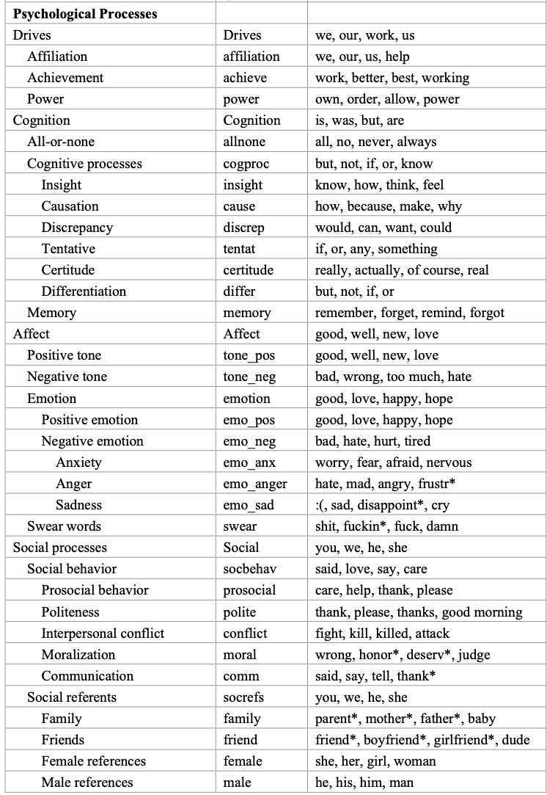

This is a list of all the categories supported by the [LIWC-22 Language Dimensions](https://www.liwc.app/static/documents/LIWC-22%20Manual%20-%20Development%20and%20Psychometrics.pdf). I recommend reading through the manual, also to get a feeling of how reliable some of these measurements are. 

---

	- **Analytic Thinking**: the degree to which people use words that suggest formal, logical, and hierarchical thinking patterns. 
		- low Analytical Thinking —> language that is more intuitive and personal
	- **Clout**: the relative social status, confidence, or leadership that people display through their writing or talking
	- **Authenticity**: the degree to which a person is self-monitoring
		- Low authenticity: prepared texts (i.e., speeches written ahead of time) and texts where a person is being socially cautious
	- **Emotional tone**: the higher the number, the more positive the tone. Numbers below 50 suggest a more negative emotional tone.

Here I report four summary variables that are calculated in LIWC. The description of the variable and the supporting literature is available [here](https://www.liwc.app/help/liwc).

// ---

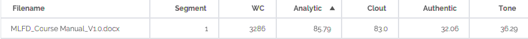
// size: contain

// ---

// size: contain

// ---
// size: contain

// size: contain
---

#### Sentiment Analysis
	- The detection of *attitudes*
		 "*enduring, affectively colored beliefs, dispositions towards objects or persons*” 
	- Main elements
		- Holder (source)
		- Target (aspect)
		- Type of attitude 
		- Text containing the attitude

	- Tasks
		- *Classification*: Is the text's attitude positive or negative?
		- *Regression*: Rank the attitude of the text from 1 to 5
		- *Advanced*: Detect the target, source, or complex attitude types

Sentiment analysis is a text analytic technique that automatically identifies and categorizes subjective information within the text. 

Specifically, we are interested in *affective meaning*, which analyzes the writer’s evaluations, opinions, emotions, and speculations.

A common typology of affective states comes from Scherer (2000):
- **Emotion**: A relatively brief episode of response to the evaluation of an external or internal event as being of significant significance (angry, sad, joyful, fearful, ashamed, proud, elated, desperate)
- **Mood**: Diffuse affect state, most pronounced as a change in subjective feeling, of low intensity but relatively long duration, often without apparent cause. (cheerful, gloomy, irritable, listless, depressed, buoyant)
- **Interpersonal stance**: Affective stance taken toward another person in a specific interaction, coloring the interpersonal exchange in that situation. (distant, cold, warm, supportive, contemptuous, friendly)
- **Attitude**: Relatively enduring, affectively colored beliefs, preferences, and predispositions towards objects or persons.
(liking, loving, hating, valuing, desiring)
- **Personality traits**: Emotionally laden, stable personality dispositions and behavior tendencies, typical for a person. (nervous, anxious, reckless, morose, hostile, jealous)

**Sentiment Analysis** is a technique used to quantify **attitudes** towards specific topics or entities that are written in an unstructured way and, thus, hard to quantify otherwise. 

One of the most basic tasks in sentiment analysis is the classification of **polarity**, i.e., to classify whether the expressed opinion is *positive*, *negative*, or *neutral*. 
It is, of course, possible to use more than three classes, e.g.,  *strongly positive*, *positive*, *neutral*, *negative*, or *strongly negative*, or to deal with the problem as a regression problem. 

Sentiment analysis can be applied to various textual resources such as surveys, reviews, and social media posts.

---
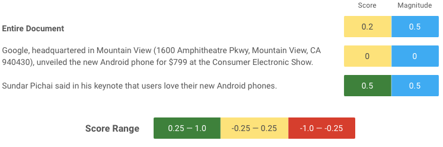

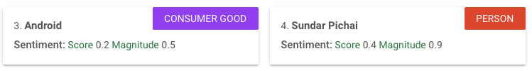

These are examples of sentiment analysis evaluated against a standard text. The first two screenshots come from a Google demonstrator, while the second is from an [IBM](https://www.ibm.com/demos/live/natural-language-understanding/self-service/home) one. You can notice how sentiment is typically measured against a whole sentence. However, it is also possible (typically by combining with POS tagging and NER) to associate a sentiment to a specific entity in the text 

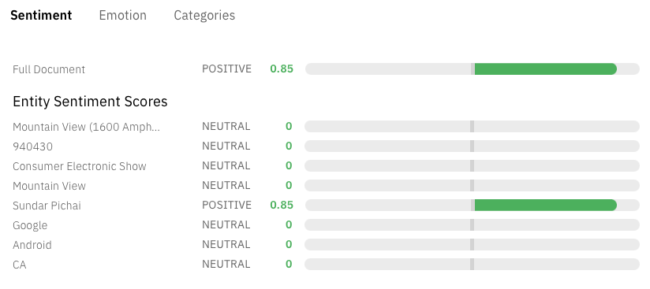

---

#### Emotion Analysis
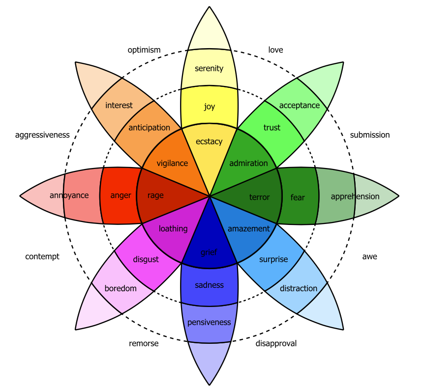

	Plutchik wheel of emotion

While sentiment analysis is framed in terms of positive and negative categories, psychologists generally regard emotion as more multifaceted. Detecting emotion has the potential to improve several language processing tasks. For instance, they automatically detect emotions in reviews or customer responses (anger, dissatisfaction, trust). Emotion can play a role in medical NLP tasks like helping diagnose depression or suicidal intent. Detecting emotions expressed toward characters in novels might play a role in understanding how different social groups were viewed by society at different times.

Perhaps the most well-known of this family of theories are the 6 emotions proposed by Ekman (1992) - happiness, surprise, fear, sadness, anger, and contempt. He argues that these six basic emotions are universal across human cultures.  Another theory is the Plutchik (1980) wheel of emotion, consisting of 8 basic emotions in four opposing pairs: joy–sadness, anger–fear, trust–disgust, and anticipation–surprise, and the emotions derived from them. These are called *atomic theories* because they assume a limited number of basic emotions (6 or 8) from which others are generated. 

Another class of emotion theories widely used in NLP considers emotion as a space in 2 or 3 dimensions (Russell, 1980):
- **valence**: the pleasantness of the stimulus
- **arousal**: the intensity of emotion provoked by the stimulus 
- **dominance**: the degree of control exerted by the stimulus

In this model, sentiment can be viewed as a special case of this second view of emotions as points in space. In particular, the valence dimension, measuring how pleasant or unpleasant a word is, is often used directly to measure sentiment.

---

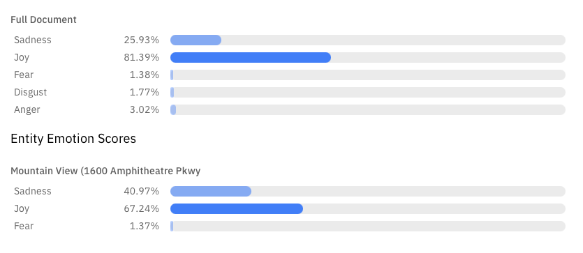

The slide shows an example of emotion recognition system from [IBM](https://www.ibm.com/demos/live/natural-language-understanding/self-service/home). It detects anger, disgust, fear, joy, or sadness that is conveyed in the content or by the context around target phrases.

---

### Semantics

Semantic analysis determines the meaning of words, sentences, and documents beyond their lexical organization. Semantic analysis includes *lexical semantics*, which is concerned with the individual words’ meanings, extending to the relationships between individual words in sentences and across sentences. 

---

#### Named Entity Recognition
	- Factual information and knowledge are usually expressed by **named entities**
		- Who, Whom, Where, When, Which, ...

	- **Identify** words that refer to proper names of interest in a particular application
		- E.g. people, companies, locations, dates, product names, prices, etc.
	- **Classify** them to the corresponding classes (e.g. person, location)
	- **Assign** a unique identifier from a database 

Part of speech tagging allows inferring that words like *Alessandro*, *Delft University of Technology*, and *Zuid Holland* are all proper nouns. From a semantic perspective, these proper nouns refer to different kinds of entities: *Alessandro* is a **Person**, *Delft University of Technology* is an **Organisation**, and *Zuid Holland* is a **Location**. 

A **named entity** is, roughly speaking, anything that can be referred to with a proper name: a *person*, a *location*, or an *organization*. Four entity tags are most common: **PER** (person), **LOC** (location), **ORG** (organization), or **GPE** (geo-political entity). Other information related to dates, times (and other temporal expressions), and even numerical expressions (e.g., prices) is also tagged as entities, although they are not entities per se. 

The task of **named entity recognition** (**NER**) is to tag a word (or multiple contiguous words) with the entity type. 

Like part of speech tagging, modern named entity recognition systems tend to be built with machine learning approaches. In some specialized contexts, these systems can be trained to tag additional information, such as symptoms, drug names, or drug reactions. 

---

This is an example of NER system in action. Source: https://cloud.google.com/natural-language#section-2

---

#### Document Categorisation
	- Assigning a label or category to an entire text or document
	- Supervised learning
	- For instance
		- Spam vs. Not spam
		- Language identification
		- Authors attribution
		- Assigning a library subject category or topic label 

	ML4D Course Description

Many NLP tasks involve *classification*, i.e., assigning a label or category to an entire text or document.

The simplest version of document classification is **binary classification tasks**. For instance, the classification emails as *spam* or *not spam*. Other tasks are multi-classes (or multi-label), e.g., language identification, or **categorization**, i.e., deciding which categories a document belongs to (in a given taxonomy). These are *supervised* machine-learning tasks similar to the ones we have encountered before in the course. 

---

#### Topic Modeling 
	- A topic is the subject or theme of a discourse
	- Topic modeling: group documents/text according to their (semantic) similarity
	- An unsupervised machine learning approach

	ML4D Course Description

**Topic modeling** is an NLP approach aimed at automatically discovering abstract *topics* that occur in a collection of documents. Topic modelling is a typical *unsupervised machine learning* task. 

Topic modeling operates under the assumption that if a document is about a particular topic, then some words are more or less likely to appear in the document. As documents typically concern multiple topics in different proportions, topic modeling techniques also use the relative proportion of words in a document to estimate similarly distributed and co-present words. The *topics* produced by topic modeling techniques are clusters of similar words. 

These type of tasks are typically explorative: a researcher sets some number of topics, runs the topic modeling algorithm, checks the nature of the topics outputted by reading the words and documents identified as having high probabilities of belonging to each of the topics, and decides whether or not those topics are substantively meaningful. If that is not the case, then the research can vary the number of topics and iterate. 

---

#### Word Sense Disambiguation
	- Multiple words can be spelled the same way (homonymy) 
	- The same word can also have different, related senses (polysemy)
	- Disambiguation depends on context!

Word sense disambiguation (WSD) is the task of determining the correct meaning of a word with multiple meanings, depending on its context. WSD algorithms use contextual information, such as surrounding words or phrases, to identify the most appropriate sense of an ambiguous word. 

The slide shows an [example](https://supwsd.net/supwsd/demo) of a WSD tool. 

---

#### Automated Summarisation

	- Condensing a piece of text to a shorter version while preserving key informational elements and the meaning of content
	- A challenging task!

	https://textsummarization.net/

	https://brevi.app/single-demo (not working!)

---

#### Machine Translation (popular languages)

Machine translation is the process of translating given text from one language to another language. The language the input text is written in is called the source language, whereas the one for the output is called the target language. One challenge in MT is the tradeoff between *fluency* and *adequacy*. The translation must be fluent, meaning the output must sound natural in the target language. Translation also needs to be adequate, meaning that the output has to reflect the meaning expressed by the input as closely as possible. These two are often in conflict, especially when the source and the target languages are not very similar (e.g., English and Chinese). A translation can be a precise, verbatim mapping of the input, but the result will likely not sound natural in the target language. On the other hand, it is possible to create an output that sounds natural in the target language but does not reflect the precise meaning. Good human translators creatively address this tradeoff.

---

#### Machine Translation (languages with fewer resources)

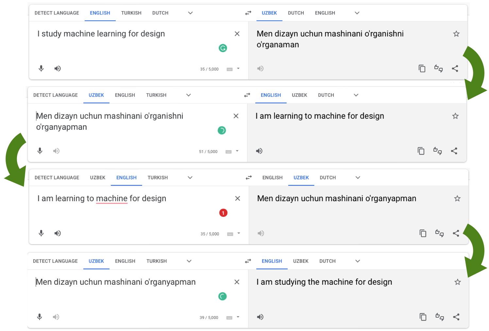

Current translation systems are built on top of ML techniques provided with examples of sentences in both the source and target language. However, such examples are not always readily available, especially for less popular languages or languages with abundant resources.  

---

#### Natural Language Instructions / Dialog systems
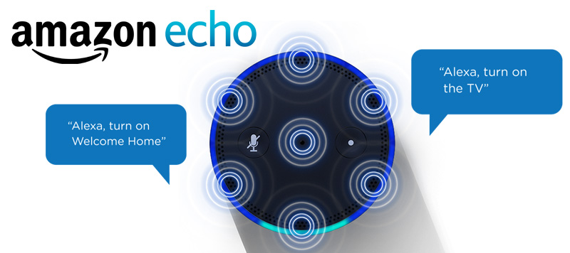

Dialog systems allow humans to interact with computers through natural language conversation, textual or vocal. The field of dialog systems has a long history. One of the earliest dialog systems, ELIZA, was developed in 1966.

The two main types of dialog systems are **task-oriented** and **chatbots**. 
- **Task-oriented** dialog systems are used to achieve specific goals. For example, commanding a car entertainment system and interacting with an Alexa-like devise to obtain some information. As described in the previous slides, task-oriented dialog systems are usually built around an NLP pipeline. These types of dialog systems are not designed to support long and complex conversations, as the goal is typically to execute a given task in the shortest possible time. Most interactions with Alexa (or Siri) only include 1 or 2 exchanges. 
- **Chatbots** dialog systems are designed to have conversations that might not have a specific goal but are more extended and interactive. Handwritten rules usually manage conversations in traditional chatbots (e.g., when the human says this, say that). 

For both types of dialog systems, recent advances in neural networks (and generative models) allow for richer, longer, and task-specific conversation. However, it will still take some time (perhaps a couple of years) to see these advanced conversation systems operate in consumer products, as their operation is computationally (and energy) intensive. 

---

#### Natural Language Generation

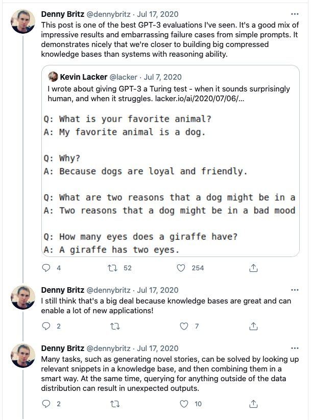

Natural Language Generation is the process of generating natural language text from something else. Generative models like ChatGPT are examples of end-to-end NLG systems. However, remember that language can also be generated according to pre-defined patterns and templates. 

---

## State of the Art in NLP
### As of ==2022==

---

	Credits: Nava Tintarev

I kept this slide - and I will probably keep it in the future - as a memento of how the progress in the field of NLP is accelerating at an incredible pace. Many of the tasks listed here were still considered difficult (or hard) in 2022 but are now becoming less and less challenging due to the emergence of large language models like GPT-3 and GPT-4.

---
#### Credits
	CIS 419/519 Applied Machine Learning. Eric Eaton, Dinesh Jayaraman. https://www.seas.upenn.edu/~cis519/spring2020/
	EECS498: Conversational AI. Kevin Leach. https://dijkstra.eecs.umich.edu/eecs498/
	CS 4650/7650: Natural Language Processing. Diyi Yang. https://www.cc.gatech.edu/classes/AY2020/cs7650_spring/
	Natural Language Processing. Alan W Black and David Mortensen. http://demo.clab.cs.cmu.edu/NLP/
	IN4325 Information Retrieval. Jie Yang. 
	Speech and Language Processing, An Introduction to Natural Language Processing, Computational Linguistics, and Speech Recognition. Third Edition. Daniel Jurafsky, James H. Martin.
	Natural Language Processing, Jacob Eisenstein, 2018.
	Text as Data. Grimmer, Justin; Roberts, Margaret E.; Stewart, Brandon M. Princeton University Press.

